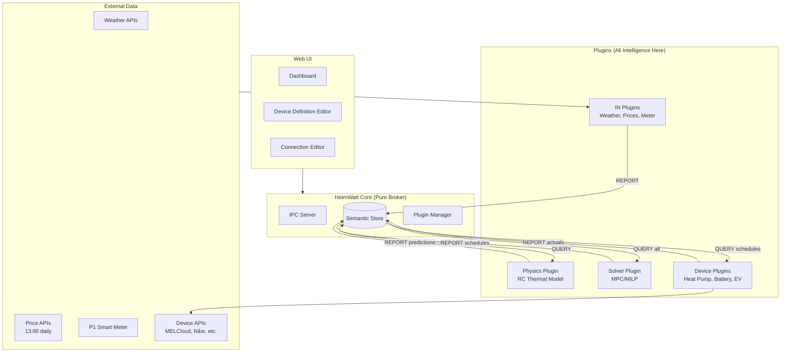

# HeimWatt Design Specification

> **Date**: 2026-01-16
> **Version**: 1.0 (Consolidated)
> **Status**: Ready for Implementation

---

## Executive Summary

HeimWatt is an extensible, local-first energy optimization platform. It minimizes electricity costs while maintaining comfort by intelligently scheduling flexible loads (heat pumps, batteries, EVs) based on dynamic electricity prices.

**Core Architecture**: Everything is a plugin. The Core is a pure broker with zero domain knowledge. Plugins compose through semantic data — they REPORT measurements and QUERY each other's outputs via Core's semantic store.

---

## 1. System Architecture



### Key Principles

| Principle | Description |
|-----------|-------------|
| **Core as Broker** | Core routes messages, stores data. Zero domain logic. |
| **Plugin Composition** | Plugins compose through semantic types, not direct calls. |
| **User Abstraction** | Users set comfort/constraints. Solver handles power. |
| **Gradual Learning** | House physics accuracy builds over time, transparently. |

---

## 2. Information Horizons (Two-Tier)

The solver always plans with the **best available information**. Unknown data is estimated, not ignored.

### Tier 1: Known Prices (Precise)

Electricity prices are released at 13:00 **for the next day**. Today's prices came from yesterday's 13:00 release.

| Time | Known Horizon | Source |
|------|---------------|--------|
| **Any time today** | All of today | Yesterday's 13:00 release |
| **After 13:00** | Today + all of tomorrow (~35h max) | Yesterday's + today's release |
| **Before 13:00** | Today only (minus elapsed hours) | Yesterday's release only |

### Tier 2: Predicted Prices (Strategic)

Beyond known prices, the solver **estimates** using available signals:

| Signal | Indicates | Typical Effect |
|--------|-----------|----------------|
| **Storm forecast** | Supply disruption, high demand | Higher prices |
| **Cold snap coming** | High heating demand | Higher prices |
| **Sunny week ahead** | High solar production | Low midday prices |
| **Wind forecast** | High wind generation | Lower prices |
| **Nuclear outage** | Reduced baseload | Higher prices |
| **Holiday/weekend** | Lower industrial demand | Lower prices |

**Price Prediction Methods**:

1. **Historical Patterns**: Same day last week/year, adjusted for weather
2. **Weather Correlation**: Train model on (weather → price) historical data
3. **Simple Heuristics**: Cold + cloudy + weekday = high; warm + sunny + weekend = low

### How It Works

```
┌──────────────────────────────────────────────────────────────────────┐
│  Solver Horizon (always uses all available data)                     │
├──────────────────────────────────────────────────────────────────────┤
│                                                                      │
│  NOW ────────── 35h ──────────────── 72h ─────────────── 7 days     │
│       │                    │                      │                  │
│       │   TIER 1           │      TIER 2          │    TIER 2        │
│       │   Known prices     │   Predicted prices    │  (lower weight)  │
│       │   (weight: 1.0)    │  (weight: 0.7)        │   (weight: 0.3)  │
│                                                                      │
│  ← Replan when 13:00 prices arrive (invalidates Tier 2) →           │
└──────────────────────────────────────────────────────────────────────┘
```

### Practical Example

**Scenario**: It's Monday 08:00. Storm forecast for Thursday.

| Horizon | Data | Action |
|---------|------|--------|
| **0-12h** | Known prices (today) | Precise schedule |
| **12-35h** | Known prices (Tuesday) | Precise schedule |
| **35-72h** | Estimated: storm → high prices Wed/Thu | Pre-charge battery Tuesday, pre-heat house |
| **72h+** | Low confidence | Maintain conservative SoC |

When Tuesday 13:00 prices arrive, the plan is recalculated with new precise data for Wednesday. The storm preparation was **not wasted** — even if prices differ from estimate, the house was warm and battery charged.

### Solver Weighting

The objective function weights future time steps by confidence:

```
Cost = Σ (price[t] × power[t] × weight[t])

where:
  weight[t] = 1.0      if t ∈ known prices
  weight[t] = 0.5-0.8  if t ∈ predicted (near term)
  weight[t] = 0.2-0.5  if t ∈ predicted (far term)
```

This prevents over-optimization on uncertain data while still using it for strategic positioning.

---

## 3. User Abstraction Layers

**Users never set power levels.** The system has three abstraction layers:

| Layer | Who | Sets | Example |
|-------|-----|------|---------|
| **1. Comfort** | User | Preferences + constraints | "Living room 20-22°C" |
| **2. Schedule** | Solver | Power trajectories | "Heat pump 2.5kW at 03:00" |
| **3. Execution** | Device Plugin | API commands | `POST /setpoint {"power": 2500}` |

If users want manual override, they use the device's own remote/app. HeimWatt doesn't compete with that.

---

## 4. Device Definitions

### Device Definition Schema

Each device type has a JSON definition that captures its physical characteristics:

```json
{
  "id": "mitsubishi-ecodan-puz-wm85vaa",
  "type": "heat_pump",
  "name": "Mitsubishi Ecodan PUZ-WM85VAA",
  "manufacturer": "Mitsubishi Electric",
  
  "protocol": {
    "type": "melcloud_api",
    "requires_credentials": true
  },
  
  "capabilities": {
    "heating": true,
    "cooling": true,
    "dhw": true,
    "variable_speed": true
  },
  
  "power_envelope": {
    "min_w": 800,
    "max_w": 8500
  },
  
  "cycle_protection": {
    "min_on_minutes": 10,
    "min_off_minutes": 5
  },
  
  "cop_curve": {
    "source": "manufacturer_datasheet",
    "points": [
      {"t_outdoor": -15, "t_supply": 35, "cop": 2.1},
      {"t_outdoor": 2, "t_supply": 35, "cop": 3.5},
      {"t_outdoor": 7, "t_supply": 35, "cop": 4.2}
    ]
  }
}
```

### Key Fields

| Field | Purpose |
|-------|---------|
| `variable_speed` | Inverter (continuous modulation) vs on/off compressor |
| `cycle_protection` | Prevents short-cycling damage to compressor |
| `power_envelope` | Min/max electrical input for solver constraints |
| `cop_curve` | Efficiency as function of temperatures |

### Device Library Locations

```
/usr/share/heimwatt/devices/    # Official (signed)
~/.heimwatt/devices/            # User-defined
```

---

## 5. Two Editors

### 5.1 Device Definition Editor

**Purpose**: Define WHAT a device IS (specs, protocol, characteristics)

**User story**: "I have a Thermia Calibra heat pump. I want to add it."

**Workflow**:
1. Select device category (heat pump, battery, EV charger, sensor)
2. Search official library or create new
3. Fill in specs (or let LLM assist in UI — not generate plugins)
4. Save to device library

**Output**: JSON file in `~/.heimwatt/devices/`

### 5.2 Connection Editor (LiteGraph.js)

**Purpose**: Wire YOUR devices in YOUR house

**User story**: "This heat pump serves my living room and bedroom."

**Nodes**:
- **Zones**: Living room, Bedroom, Kitchen
- **Devices**: Heat pump, Battery, EV charger
- **Sensors**: Temperature, Power meter
- **Constraints**: "EV charged by 07:00"

**Edges**: "serves", "measures", "constrains"

**Output**: JSON configuration describing the installation

```json
{
  "zones": [
    {"id": "living_room", "comfort_range": {"min": 20, "max": 22}}
  ],
  "devices": [
    {"instance_id": "hp:main", "device_def": "mitsubishi-ecodan", "serves_zones": ["living_room"]}
  ],
  "constraints": [
    {"type": "must_be_charged", "device": "ev:i3", "by_time": "07:00", "target_soc": 80}
  ]
}
```

---

## 6. House Physics (Gradual Learning)

### How It Works

The Physics Plugin models the house as an RC thermal network. Accuracy improves **automatically over time** as more data is collected:

| Stage | Data Available | Accuracy |
|-------|----------------|----------|
| **Day 1** | Installed, minimal data | Default assumptions |
| **Week 1** | Basic temperature patterns | Rough R estimates |
| **Week 2+** | Heating cycles observed | R and C estimated |
| **Month 1+** | Seasonal variation | Weather-adjusted model |

### User-Triggered Calibration

Users can **optionally** trigger a calibration run (e.g., going away for a weekend):

1. UI: "Run calibration for 48 hours"
2. System runs controlled heating cycles
3. Faster, more accurate parameter estimation

This is transparent — users don't need to understand RC networks.

---

## 7. Hardware Integration

### 7.1 P1 Smart Meter (Main Grid Connection)

Swedish smart meters expose real-time data via the P1/HAN port.

**Protocol**:
| Aspect | Specification |
|--------|---------------|
| **Connector** | RJ12 (Vattenfall) or RJ45 (some Ellevio) |
| **Protocol** | IEC 62056-21 (OBIS codes) |
| **Update Rate** | 1-10 seconds |
| **Activation** | Via grid owner portal (Mina sidor), 2-day delay |

**Hardware Options** (Implement both):

| Device | Price | Connection | Priority |
|--------|-------|------------|----------|
| **SlimmeLezer+** | ~€25 | WiFi → MQTT | ✓ Start here |
| **Tibber Pulse** | ~€100 | Cloud API | ✓ Start here |
| **P1 USB Cable** | ~€15 | Serial | Later |

**OBIS Codes**:
```
1-0:1.7.0    Active Import Power   W     (what you're using now)
1-0:2.7.0    Active Export Power   W     (solar feeding back)
1-0:1.8.0    Total Import          kWh   (cumulative meter reading)
1-0:2.8.0    Total Export          kWh   (cumulative export)
1-0:32.7.0   L1 Voltage            V
1-0:31.7.0   L1 Current            A
```

### 7.2 CT Clamps (Sub-Metering)

CT (Current Transformer) clamps enable monitoring of **any circuit** without rewiring — perfect for sub-metering individual loads.

**What They Are**: A split-core sensor that clips around a single wire and measures current via magnetic induction.

**Use Cases**:
- Monitor well pump in the yard
- Monitor shed/garage separately
- Monitor individual circuits (oven, dryer, etc.)
- Verify heat pump actual consumption vs reported

**Specifications**:

| Aspect | Details |
|--------|---------|
| **Accuracy** | ±1-2% typical (±5% at very low currents <1A) |
| **Installation** | DIY-friendly with split-core clamps (no electrician needed) |
| **Requirements** | Must clamp around SINGLE wire (not multi-core cable) |
| **Orientation** | Arrow must point toward load (or readings will be negative) |
| **Power** | Device needs separate power supply (WiFi plugs into outlet) |

**Recommended Products**:

| Device | Price | Channels | Notes |
|--------|-------|----------|-------|
| **Shelly EM** | ~€35 | 2 | WiFi, 50A CT included, good for single-phase |
| **Shelly Pro 3EM** | ~€90 | 3 | Best for 3-phase or whole-house |
| **Emporia Vue 2** | ~€100 | 16 | Circuit-level monitoring, cloud-based |
| **IotaWatt** | ~€150 | 14 | Open source, local processing, highly accurate |

**Installation Tips**:
1. **Split-core = no rewiring**: Open clamp, clip around wire, close
2. **Single conductor only**: Never clamp around the whole cable (currents cancel)
3. **Check orientation**: Arrow toward load, or you get negative readings
4. **Verify with bill**: Compare readings to utility bill over a month

**HeimWatt Integration**:
- CT devices report to Home Assistant or MQTT
- HeimWatt can have a `shelly_em` plugin that subscribes to MQTT
- Or integrate via Home Assistant bridge

---

## 8. Resilience & Event Handling

HeimWatt manages critical events (storms, price spikes) through **Notification Plugins** and **User Choice**.

### The Mechanism

1.  **Event Plugin** (`smhi_warnings`) detects event (e.g., Class 2 Snow Warning).
2.  **Notification Plugin** (`pushover`, `ntfy`) sends interactive alert to user.
3.  **User Choice**: User selects policy ("Survival Mode" vs "Profit Mode").
4.  **Solver** applies constraints based on that choice.

### Example: "Snow Storm Coming"

**Scenario**: Warning for blizzard in 72h.

1.  **Detection**: `smhi_warnings` sees alert.
2.  **Notification**:
    > ⚠️ **Storm Warning**: Blizzard predicted for Thursday.
    > Risk of power outage. High prices expected.
    >
    > [**Enable Survival Mode**] (Keep battery 100%, Heat 24°C)
    > [**Optimize for Profit**] (Sell at price spike, risk empty battery)
    > [**Ignore**] (Business as usual)

3.  **Solver Action**:
    - **If Survival Mode**: `constraint.storage.soc.min = 90%` (safe margin), `constraint.zone.temp.min = 23°C`
    - **If Profit Mode**: Discharge battery during price spike to sell to grid.
    - **No Response**: Default policy applies (e.g., "be safe but not extreme" -> `soc.min = 50%`).

### Configurable Policies

Users define their default behavior in `config/policies.json`:

```json
{
  "event_policies": {
    "storm_warning": {
      "default_action": "ask_user",
      "timeout_action": "safe_mode",
      "safe_mode": {"min_soc": 80, "preheat": true}
    },
    "extreme_price_spike": {
      "default_action": "profit_mode"
    }
  }
}
```

This prevents the system from being "too smart" and doing the wrong thing (e.g., keeping a full battery when you wanted to sell).

---

## 9. Schedule Semantic Types

### The Problem

The solver computes a 48-hour power schedule. How is this communicated to device plugins?

### Solution: Schedule Blobs (Tier 2 Data)

Schedules are stored as **JSON blobs**, not individual data points:

```json
{
  "semantic_type": "schedule.heat_pump.power",
  "created_at": "2026-01-17T13:05:00Z",
  "horizon_hours": 35,
  "interval_seconds": 900,
  "unit": "W",
  "values": [2500, 2500, 2000, 1500, 1000, 800, 800, ...]
}
```

**Device Plugin Pattern**:
1. On tick (configurable interval defined in manifest, e.g., 60s or 10ms for sensitive fans), query `schedule.heat_pump.power`
2. Find value for current timestamp (interpolating if needed)
3. If different from last command: send to device, respecting `cycle_protection`
4. Report `hvac.power.actual`

### New Semantic Types

| Category | Type | Unit | Description |
|----------|------|------|-------------|
| **Schedules** | `schedule.heat_pump.power` | W | Electrical input |
| | `schedule.battery.power` | W | +charge, -discharge |
| | `schedule.ev.power` | W | Charging power |
| **Actuals** | `hvac.power.actual` | W | Measured consumption |
| | `hvac.cop.actual` | - | Measured efficiency |
| | `storage.power.actual` | W | Measured battery flow |
| **Grid** | `energy.grid.import.power` | W | Current import |
| | `energy.grid.export.power` | W | Current export |
| | `energy.grid.voltage.l1` | V | Phase voltage |
| **Constraints** | `constraint.storage.soc.target` | % | Day-ahead → intra-day |
| | `constraint.solver.status` | enum | ok/infeasible/degraded |

---

## 10. Plugin Trust Model

| Tier | Source | Trust | Loading |
|------|--------|-------|---------|
| **Official** | HeimWatt signed | Full | Automatic |
| **Community** | Shared, unreviewed | Warning | Manual approval |
| **Local** | User-created | Full (user's machine) | Automatic |

**Signing**: Official plugins signed with HeimWatt private key. Core verifies before loading.

---

## 11. Vendor API Wrapping

**The Vision**: Replace 5+ vendor apps with HeimWatt as single pane of glass.

| Brand | API | Status |
|-------|-----|--------|
| Mitsubishi | MELCloud | Well documented |
| Nibe | Uplink | Official API |
| Thermia | Thermia Online | Reverse engineered |
| Tesla (car) | Fleet API | Official |
| Tesla (Powerwall) | Local API | Reverse engineered |
| Various EVSE | OCPP | Standard protocol |

Each wrapper is a device plugin that:
1. Authenticates with vendor cloud
2. Queries schedules from Core
3. Sends commands to vendor API
4. Reports actuals back to Core

---

## 12. LLM Integration (Limited Scope)

**NOT doing**: Full plugin generation from API docs (research-grade problem)

**Doing**: LLM as UI helper for:
- Searching for device specs
- Filling in COP curves from datasheets
- Suggesting similar devices from library
- Helping with constraint definitions

---

## 13. Simulation Bundle

For development and testing:

| Plugin | Simulates |
|--------|-----------|
| `sim_weather` | Weather forecasts |
| `sim_prices` | Spot prices with spikes |
| `sim_house` | RC thermal model |
| `sim_heat_pump` | COP curve, cycle protection |
| `sim_battery` | SoC dynamics |
| `sim_meter` | P1 meter readings |

```bash
./heimwatt --config config/simulation.json
```

---

## 14. Next Steps

### Immediate (V1)

1. **Add semantic types** for schedules, actuals, grid metering
2. **Implement SlimmeLezer+ plugin** (WiFi P1 reader)
3. **Implement Shelly EM plugin** (CT clamp sub-metering)
4. **Create simulation bundle** for development
5. **Build basic solver** (Python, PuLP/HiGHS)
6. **Prototype connection editor** (LiteGraph.js)

### Near-term (V1.x)

7. **Device definition editor** in web UI
8. **MELCloud wrapper plugin** (first vendor API)
9. **Tibber Pulse integration**
10. **Physics plugin** with gradual learning

### Future (V2+)

11. Multi-zone thermal modeling
12. Signed plugin distribution
13. Additional vendor API wrappers
14. Enhanced node editor for complex constraints

---

## Appendix A: File Locations

```
/usr/share/heimwatt/
├── plugins/                    # Official signed plugins
└── devices/                    # Official device definitions

~/.heimwatt/
├── config/                     # User configuration
│   ├── system.json            # Generated by connection editor
│   └── credentials.json       # Vault for API tokens
├── plugins/                    # User/community plugins
├── devices/                    # User device definitions
└── data/
    └── heimwatt.db            # SQLite semantic store

/var/log/heimwatt/
└── heimwatt.log               # Application logs
```

## Appendix B: Glossary

| Term | Definition |
|------|------------|
| **Semantic Type** | A named data category (e.g., `atmosphere.temperature`) |
| **REPORT** | IPC message: plugin → Core (sending data) |
| **QUERY** | IPC message: plugin → Core (requesting data) |
| **RC Model** | Resistance-Capacitance thermal network |
| **COP** | Coefficient of Performance (heat output / electrical input) |
| **MPC** | Model Predictive Control (optimization with rolling horizon) |
| **MILP** | Mixed-Integer Linear Programming |
| **P1 Port** | Customer interface on Swedish smart meters |
| **OBIS** | Object Identification System (standard meter data codes) |
| **CT Clamp** | Current Transformer for non-invasive power measurement |
