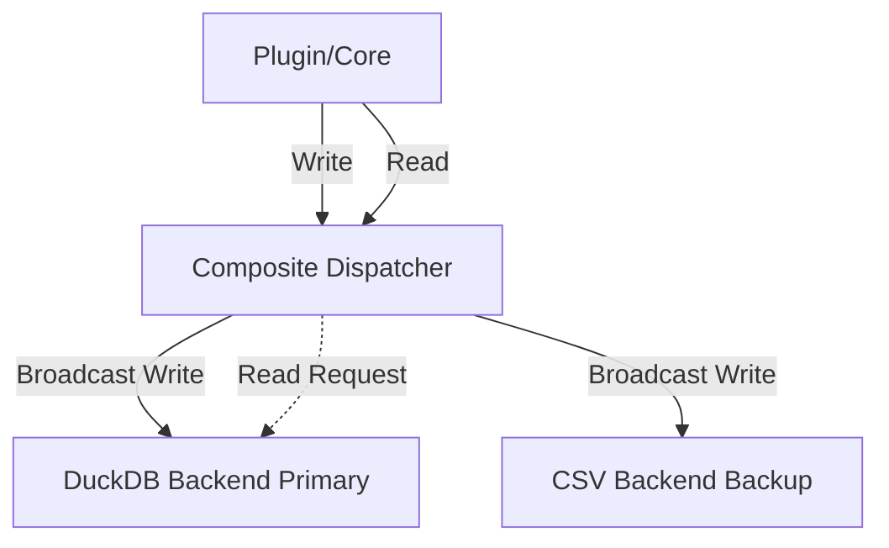

# HeimWatt Database Manual

## Overview

HeimWatt employs a **Multi-Backend Composite Database** architecture. This allows the system to write data to multiple storage engines simultaneously while reading from a single "primary" source.

### Architecture



- **Writes**: Data insertions are broadcast to *all* configured backends. If a secondary backend fails, a warning is logged, but the operation succeeds if the primary backend succeeds.
- **Reads**: All queries (latest value, range queries) are routed *only* to the backend marked as `primary`.

---

## Configuration

The database is configured in `config/heimwatt.json` under the `storage` key.

### Default Configuration (DuckDB + CSV)

By default, HeimWatt uses DuckDB as the primary storage for performance, with CSV enabled as a secondary backend for debugging and backup visibility.

```json
{
    "storage": {
        "backends": [
            {
                "type": "duckdb",
                "path": "data/heimwatt.duckdb",
                "primary": true
            },
            {
                "type": "csv",
                "path": "data/csv",
                "primary": false
            }
        ],
        "csv_disk_write_interval_sec": 60
    }
}
```

### Configuration Options

| Field | Type | Description |
|-------|------|-------------|
| `type` | String | Backend type. Supported: `"duckdb"` (Recommended), `"csv"`. |
| `path` | String | Path to the storage location. For CSV, this is a directory. For DuckDB, a file path. |
| `primary`| Boolean| If `true`, this backend is used for serving read queries. Exactly one backend should be primary. |

**Note on Conflicts:**
If multiple backends are configured with `"primary": true`, HeimWatt will use the **first** one encountered in the list. A warning will be logged indicating the conflict and which backend was selected.

**Global Storage Options:**

| Field | Description |
|-------|-------------|
| `csv_disk_write_interval_sec` | Frequency (in seconds) at which the CSV backend flushes buffers to disk (fsync). Default: 60. |

---

## Supported Backends

### DuckDB (`type: "duckdb"`)
- **Format**: Single-file OLAP database.
- **Pros**: Extremely fast analytics and range queries.
- **Cons**: Binary format (requires tools to read externally).

### CSV (`type: "csv"`)
- **Format**: Text-based CSV files, partitioned by date (`YYYY-MM-DD.csv`).
- **Pros**: Human-readable, simple, effectively strictly append-only.
- **Cons**: Slower range queries on large datasets. Primarily used for debugging or archival.
