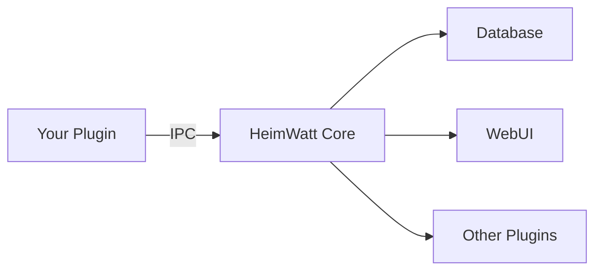
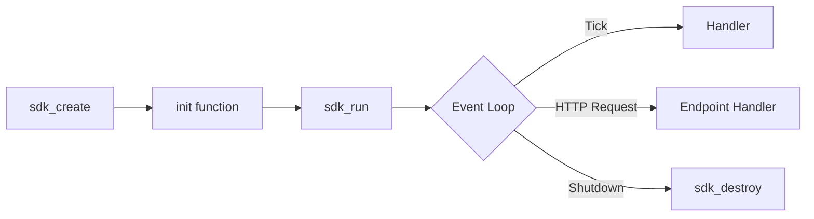

# HeimWatt SDK Manual

## Overview

The HeimWatt SDK lets you build plugins that connect **anything** to your home automation system. If it has an API, a sensor, or a serial port — you can integrate it.

### What Can You Build?

| Category | Examples |
|----------|----------|
| **Energy** | Heat pump control, battery optimization, solar inverter monitoring |
| **Garden** | Soil moisture sensors, automated irrigation, weather-based watering |
| **Finance** | Stock portfolio tracker, crypto price alerts, electricity bill forecasting |
| **Monitoring** | Tank level sensors, freezer temperature alerts, door/window sensors |
| **Notifications** | Telegram bots, email alerts, smart home voice announcements |
| **Custom Hardware** | Arduino sensors, Raspberry Pi GPIO, serial devices, Zigbee bridges |

### Architecture

Plugins run as **isolated processes** communicating with Core via IPC. This means:
- A crashing plugin doesn't take down the system
- Plugins can be written in any language (with IPC bindings)
- Each plugin has its own memory space



### Plugin Lifecycle



---

## Manifest Schema

Every plugin requires a `manifest.json`. Here are examples for different use cases:

### Example: Garden Irrigation

```json
{
  "id": "com.mygarden.irrigation",
  "name": "Smart Irrigation",
  "version": "1.0.0",
  "capabilities": ["report", "actuate"],
  "devices": [
    {
      "type": "sensor",
      "name": "Soil Moisture Sensor",
      "provides": ["garden.soil_moisture"]
    },
    {
      "type": "valve",
      "name": "Garden Sprinkler",
      "provides": ["garden.valve.state"]
    }
  ],
  "schedule": {
    "interval_seconds": 900
  }
}
```

### Example: Stock Portfolio Tracker

```json
{
  "id": "com.myfinance.stocks",
  "name": "Stock Portfolio",
  "version": "1.0.0",
  "capabilities": ["report"],
  "credentials": {
    "type": "api_key",
    "required": ["api_key"],
    "display_name": "Alpha Vantage API Key"
  },
  "schedule": {
    "interval_seconds": 300
  }
}
```

### Example: Heat Pump Control

```json
{
  "id": "com.heimwatt.melcloud",
  "name": "MELCloud Integration",
  "version": "1.0.0",
  "capabilities": ["report", "query", "actuate"],
  "devices": [
    {
      "type": "heat_pump",
      "name": "Heat Pump",
      "provides": ["hvac.power.actual", "hvac.cop.actual"],
      "consumes": ["schedule.heat_pump.power"]
    }
  ],
  "credentials": {
    "type": "password",
    "required": ["username", "password"],
    "display_name": "MELCloud Account"
  },
  "schedule": {
    "interval_seconds": 3600
  }
}
```

### Fields

| Field | Type | Description |
|-------|------|-------------|
| `id` | String | Unique reverse-domain identifier |
| `name` | String | Human-readable name |
| `version` | String | Semantic version |
| `capabilities` | Array | Plugin capabilities (see below) |
| `devices` | Array | Devices this plugin provides |
| `credentials` | Object | Authentication requirements |
| `schedule` | Object | Scheduling configuration |

### Capabilities

| Capability | Description | SDK Requirement |
|------------|-------------|-----------------|
| `report` | Push semantic data to Core | `sdk_report_*` functions |
| `query` | Pull semantic data from Core | `sdk_query_*` functions |
| `actuate` | Control external devices | `sdk_device_setpoint` |
| `constrain` | Provide optimization constraints | `sdk_query_constraints` |
| `sense` | Real-time sensor stream | `sdk_register_fd` |

---

## Core API

### Lifecycle

```c
#include <heimwatt_sdk.h>

/**
 * @brief  Initialize plugin context from command-line arguments.
 * @param  ctx_out Output pointer for plugin context.
 * @param  argc    Argument count from main().
 * @param  argv    Argument vector from main().
 * @return 0 on success, negative errno on failure.
 */
int sdk_create(plugin_ctx **ctx_out, int argc, char **argv);

/**
 * @brief  Run the plugin event loop. Blocks until shutdown.
 * @param  ctx Plugin context.
 * @return 0 on clean shutdown, negative errno on failure.
 */
int sdk_run(plugin_ctx *ctx);

/**
 * @brief  Destroy plugin context and release resources.
 * @param  ctx_ptr Pointer to context pointer. Set to NULL after destruction.
 */
void sdk_destroy(plugin_ctx **ctx_ptr);
```

### Plugin Entry Point

Use the `HEIMWATT_PLUGIN_ENTRY` macro:

```c
#include <heimwatt_sdk.h>

static void on_tick(plugin_ctx *ctx, int64_t timestamp) {
    // Called on schedule interval
    sdk_report_value(ctx, "atmosphere.temperature", 22.5, timestamp);
}

int init(plugin_ctx *ctx) {
    return sdk_register_ticker(ctx, on_tick);
}

HEIMWATT_PLUGIN_ENTRY(init)
```

---

## Reporting Data

Push semantic data to Core:

```c
/**
 * @brief  Report a semantic value to Core.
 * @param  ctx       Plugin context.
 * @param  type_name Canonical semantic type (e.g., "atmosphere.temperature").
 * @param  value     Numeric value in canonical units.
 * @param  ts        Unix timestamp (0 = now).
 * @return 0 on success, negative errno on failure.
 */
int sdk_report_value(plugin_ctx *ctx, const char *type_name, double value, int64_t ts);

/**
 * @brief  Report a price value with currency.
 * @param  currency  ISO 4217 currency code (e.g., "SEK", "EUR").
 */
int sdk_report_price(plugin_ctx *ctx, const char *type_name, double value,
                     const char *currency, int64_t ts);
```

### Example: Weather Plugin

```c
static void on_tick(plugin_ctx *ctx, int64_t now) {
    json_value *data = NULL;
    char *url = NULL;

    if (sdk_get_config(ctx, "url_forecast", &url) < 0) {
        sdk_log(ctx, SDK_LOG_ERROR, "Missing url_forecast config");
        return;
    }

    if (sdk_fetch_json(ctx, url, &data) < 0) {
        sdk_log(ctx, SDK_LOG_ERROR, "Failed to fetch forecast");
        goto cleanup;
    }

    // Parse and report
    const json_value *temp = sdk_json_get(data, "temperature");
    sdk_report_value(ctx, "atmosphere.temperature", sdk_json_number(temp), now);

cleanup:
    sdk_json_free(data);
    mem_free(url);
}
```

---

## Querying Data

Pull semantic data from Core (for OUT plugins):

```c
typedef struct {
    int64_t timestamp;
    double value;
    char currency[4];
} sdk_data_point;

/**
 * @brief  Query the latest value for a semantic type.
 * @param  type Semantic type enum.
 * @param  out  Output data point.
 * @return 0 on success, -ENOENT if no data, negative errno on failure.
 */
int sdk_query_latest(plugin_ctx *ctx, semantic_type type, sdk_data_point *out);

/**
 * @brief  Query historical range.
 * @param  out_array  Output array (caller must call sdk_data_point_destroy).
 * @param  out_count  Number of points returned.
 */
int sdk_query_history(plugin_ctx *ctx, semantic_type type,
                      int64_t from_ts, int64_t to_ts,
                      sdk_data_point **out_array, size_t *out_count);

void sdk_data_point_destroy(sdk_data_point **points_ptr);
```

---

## Credential Management

Access credentials stored by Core:

```c
/**
 * @brief  Retrieve a credential for this plugin.
 * @param  key       Credential key (e.g., "access_token", "username").
 * @param  value     Output pointer. Caller must call sdk_credential_destroy.
 * @return 0 on success, -ENOENT if not found, negative errno on failure.
 *
 * Core handles OAuth token refresh transparently. The returned token
 * is always valid (or an error is returned if refresh failed).
 */
int sdk_credential_get(plugin_ctx *ctx, const char *key, char **value);

/**
 * @brief  Zero and free a credential. MUST be called after use.
 * @param  value Pointer to credential pointer. Set to NULL after destruction.
 */
void sdk_credential_destroy(char **value);
```

### Usage Pattern

```c
char *token = NULL;

if (sdk_credential_get(ctx, "access_token", &token) < 0) {
    sdk_log(ctx, SDK_LOG_ERROR, "Failed to get access token");
    return -1;
}

// Use token immediately
int status = make_api_request(token);

// Zero and free - do not hold credentials longer than necessary
sdk_credential_destroy(&token);

return status;
```

---

## Scheduling

Register handlers for periodic execution:

```c
typedef void (*sdk_tick_handler)(plugin_ctx *ctx, int64_t timestamp);

/**
 * @brief  Register handler for manifest's interval_seconds.
 */
int sdk_register_ticker(plugin_ctx *ctx, sdk_tick_handler handler);

/**
 * @brief  Register cron-style schedule.
 * @param  expression Cron expression (e.g., "0 * * * *" = every hour).
 */
int sdk_register_cron(plugin_ctx *ctx, const char *expression,
                      sdk_tick_handler handler);
```

---

## HTTP Endpoints (OUT Plugins)

OUT plugins can expose HTTP endpoints:

```c
typedef int (*sdk_api_handler)(plugin_ctx *ctx, const sdk_req *req, sdk_resp *resp);

/**
 * @brief  Register an HTTP endpoint.
 * @param  method HTTP method ("GET", "POST").
 * @param  path   URL path (e.g., "/calculate").
 */
int sdk_register_endpoint(plugin_ctx *ctx, const char *method, const char *path,
                          sdk_api_handler handler);

// Request accessors
const char *sdk_req_method(const sdk_req *req);
const char *sdk_req_path(const sdk_req *req);
const char *sdk_req_query_param(const sdk_req *req, const char *key);

// Response builders
void sdk_resp_set_status(sdk_resp *resp, int code);
void sdk_resp_set_json(sdk_resp *resp, const char *json_body);
void sdk_resp_set_header(sdk_resp *resp, const char *key, const char *val);
```

### Example: Calculator Endpoint

```c
static int handle_calculate(plugin_ctx *ctx, const sdk_req *req, sdk_resp *resp) {
    sdk_data_point price = {0};

    if (sdk_query_latest(ctx, ENERGY_PRICE_SPOT, &price) < 0) {
        sdk_resp_set_status(resp, 503);
        sdk_resp_set_json(resp, "{\"error\": \"Price data unavailable\"}");
        return 0;
    }

    char body[256];
    snprintf(body, sizeof(body),
             "{\"price\": %.4f, \"currency\": \"%s\"}",
             price.value, price.currency);

    sdk_resp_set_status(resp, 200);
    sdk_resp_set_json(resp, body);
    return 0;
}

int init(plugin_ctx *ctx) {
    return sdk_register_endpoint(ctx, "GET", "/price", handle_calculate);
}
```

---

## Logging

```c
typedef enum {
    SDK_LOG_DEBUG,
    SDK_LOG_INFO,
    SDK_LOG_WARN,
    SDK_LOG_ERROR
} sdk_log_level;

void sdk_log(const plugin_ctx *ctx, sdk_log_level level, const char *fmt, ...);
```

### Usage

```c
sdk_log(ctx, SDK_LOG_INFO, "Fetched %zu data points", count);
sdk_log(ctx, SDK_LOG_ERROR, "API request failed: %s", error_msg);
```

---

## Safety Constraints

Plugins with `actuate` capability should declare safety limits:

```json
{
  "safety": {
    "min_cycle_s": 600,
    "max_cycles_per_hour": 3,
    "max_setpoint_c": 55
  }
}
```

SDK enforces these limits before sending commands. Commands that violate limits are rejected with a warning.

---

## Best Practices

1.  **Zero credentials immediately**: Call `sdk_credential_destroy` as soon as you're done with a credential.
2.  **Handle disconnection gracefully**: If `sdk_credential_get` fails, report "disconnected" status.
3.  **Use canonical types**: Reference `semantic_types.md` for valid type names.
4.  **Log meaningful context**: Include identifiers and values, not just "error occurred".
5.  **Declare all devices**: Every controllable device must be in the manifest.
