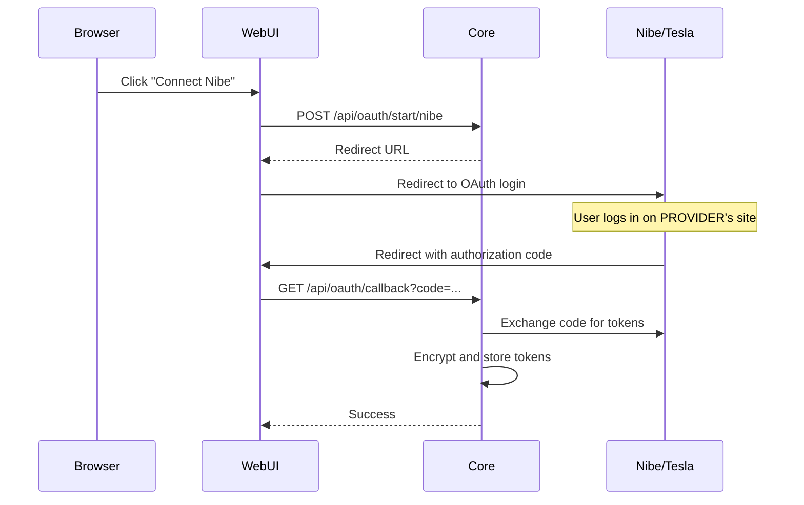

# HeimWatt Security Manual

## Overview

HeimWatt implements defense-in-depth security for a home energy management appliance. This manual covers user authentication, credential storage, and external service connections.

---

## User Authentication

HeimWatt is a single-user appliance. One admin password protects the system.

### First-Run Setup

On first launch, the WebUI prompts for password creation:

1. User creates admin password
2. Password derives encryption key (see Credential Encryption)
3. JWT session token issued

> **Important**: The admin password also encrypts all external service credentials. If forgotten, external services must be reconnected.

### Session Management

| Property | Value |
|----------|-------|
| Token Type | JWT (JSON Web Token) |
| Expiry | 30 days |
| Refresh | Automatic on activity |
| Storage | HTTP-only cookie |

```
POST /api/auth/login
Body: { "password": "..." }
Response: Set-Cookie: hw_session=<JWT>
```

All subsequent API requests require the session cookie.

### Password Change

1. User provides current password (verifies identity)
2. All credentials decrypted with old key
3. New key derived from new password
4. All credentials re-encrypted
5. All existing sessions invalidated

External services **remain connected** during password change.

### Password Reset

If the password is forgotten:

1. Factory reset via physical access (button hold or config file delete)
2. All encrypted credentials are **lost**
3. User must reconnect all external services

This is a deliberate security trade-off: credentials cannot be recovered without the password.

---

## Credential Storage

HeimWatt stores credentials for external services (Nibe, MELCloud, etc.) encrypted at rest.

### Encryption Architecture

```
User Password
     │
     ▼
┌─────────────────────────────────────────────┐
│  Argon2id (memory-hard KDF)                 │
│  - Salt: random 16 bytes (stored)           │
│  - Memory: 64 MB                            │
│  - Iterations: 3                            │
│  - Output: 256-bit key                      │
└─────────────────────────────────────────────┘
     │
     ▼
┌─────────────────────────────────────────────┐
│  AES-256-GCM                                │
│  - Authenticated encryption                 │
│  - Unique nonce per credential              │
│  - Integrity verification on decrypt        │
└─────────────────────────────────────────────┘
     │
     ▼
  Encrypted Credential Blob
  (stored in credentials.enc)
```

### Security Properties

| Property | Implementation |
|----------|---------------|
| Encryption | AES-256-GCM (authenticated) |
| Key Derivation | Argon2id (memory-hard, GPU-resistant) |
| Storage | Single encrypted file, not individual fields |
| Access | Plugins request credentials via IPC |
| Memory | Credentials zeroed after use |
| Audit | All credential access logged |

### Why Argon2id?

Argon2 is the winner of the Password Hashing Competition (2015). The "id" variant provides:

- **Memory-hardness**: Requires 64 MB RAM, defeating GPU attacks
- **Time-hardness**: 3 iterations, preventing brute force
- **Side-channel resistance**: Hybrid of Argon2i and Argon2d

---

## External Service Authentication

### Authentication Types

| Type | Use Case | How Credentials Are Stored |
|------|----------|---------------------------|
| `oauth` | Modern APIs (Nibe, Tesla, Tibber) | Access token + refresh token |
| `oauth_user_provided` | Community plugins | User's client credentials + tokens |
| `password` | Legacy APIs (MELCloud) | Username + password |
| `api_key` | Simple APIs (Nordpool) | API key |

### OAuth Flow

For providers with OAuth support:



**Key security properties**:
- HeimWatt never sees the user's provider password
- Tokens can be revoked by user on provider's side
- Tokens are scoped (read-only vs. control)

### Token Refresh

OAuth tokens expire. Core handles refresh transparently:

1. Plugin calls `sdk_credential_get("access_token")`
2. Core checks token expiry
3. If expired/expiring, Core uses refresh_token to get new access_token
4. Plugin receives fresh token (never knows refresh happened)

If refresh fails (user revoked access, provider error):
- `sdk_credential_get` returns error
- WebUI shows "Reconnect" button
- User must re-authenticate with provider

### Password/API Key Storage

For providers without OAuth:

1. User enters credentials in WebUI form
2. Credentials sent over HTTPS to Core
3. Core encrypts with password-derived key
4. Plugin retrieves via `sdk_credential_get`

> **Security Note**: Unlike OAuth, HeimWatt stores the actual password. Use OAuth-supporting providers when possible.

---

## Plugin Credential Access

Plugins access credentials through the SDK:

```c
char *token = NULL;

// Request credential (Core handles token refresh)
if (sdk_credential_get(ctx, "access_token", &token) < 0) {
    // Handle disconnection
    return -1;
}

// Use immediately
make_api_call(token);

// Zero and free - REQUIRED
sdk_credential_destroy(&token);
```

### Security Rules

1. **Scoped Access**: Plugins can only access their own credentials
2. **No Persistence**: Plugins must not write credentials to disk
3. **Immediate Zeroing**: Call `sdk_credential_destroy` immediately after use
4. **Audit Trail**: All credential access is logged

---

## Network Security

### Local-First Design

HeimWatt is designed for local network operation:

| Component | Network Exposure |
|-----------|-----------------|
| Core API | Local network only (by default) |
| WebUI | Local network only |
| Plugins | Outbound HTTPS to provider APIs |

### Remote Access

For remote access, use a reverse proxy with TLS:

```
Internet → Reverse Proxy (TLS) → HeimWatt (HTTP)
```

Recommended: Caddy, Traefik, or nginx with Let's Encrypt.

HeimWatt does **not** implement TLS directly. This is intentional:
- Simplifies Core (no certificate management)
- Proxy handles renewal, OCSP, etc.
- Standard deployment pattern for appliances

---

## Device Control Safety

Plugins with `actuate` capability can control physical devices. HeimWatt enforces safety constraints.

### User Approval

When installing a plugin with `actuate`:

1. WebUI shows warning: "This plugin can control: Heat Pump"
2. User must explicitly approve
3. Approval stored in plugin registry

### Rate Limiting

Multi-layer protection against rapid cycling:

| Layer | Enforcer | Example |
|-------|----------|---------|
| Solver | Optimization constraints | No cycle within 5 minutes |
| SDK | Device-type defaults | Heat pump: min 10 min cycle |
| Plugin | Device-specific limits | This model: min 15 min |
| Hardware | Built-in protection | Compressor lockout |

### Audit Trail

All device commands are logged:

```
2026-01-21 14:32:15 | Heat Pump | Setpoint 22→21°C | Source: Solver | ✓ Executed
2026-01-21 14:34:45 | Battery   | Charge 2kW       | Source: Solver | ✗ Rejected (min cycle)
```

Visible in WebUI under "Activity Log".

---

## Threat Model

| Threat | Mitigation |
|--------|------------|
| Unauthorized local access | Password authentication, session cookies |
| Credential theft (disk) | AES-256-GCM encryption, Argon2id key derivation |
| Credential theft (memory) | Immediate zeroing, scoped plugin access |
| Network sniffing | HTTPS for provider APIs, recommend TLS proxy for remote |
| Malicious plugin | Capability approval, scoped credential access, audit logging |
| Rapid device cycling | Solver constraints, SDK limits, hardware failsafe |

---

## Best Practices

1. **Use strong password**: The admin password protects all credentials.
2. **Prefer OAuth providers**: Password storage is less secure than OAuth tokens.
3. **Review plugin approvals**: Check which plugins have `actuate` capability.
4. **Use reverse proxy for remote access**: Don't expose HeimWatt directly to internet.
5. **Monitor activity log**: Watch for unexpected device commands.
