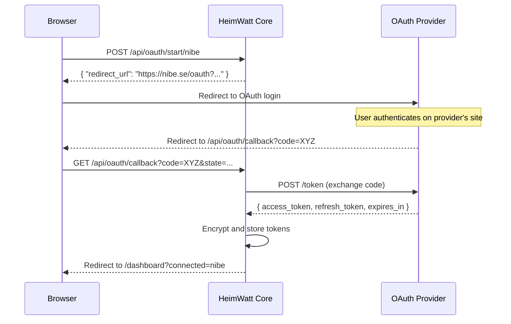

# HeimWatt Security Manual

> **Status**: 🚧 NOT IMPLEMENTED  
> **Last Updated**: 2026-01-21

This document is the implementation spec for HeimWatt security features. Implementation should follow this document exactly.

---

## Overview

HeimWatt implements defense-in-depth security for a home energy management appliance:

| Layer | What It Protects | Mechanism |
|-------|------------------|-----------|
| Authentication | WebUI access | Password + JWT sessions |
| Encryption | External service credentials | Argon2id + AES-256-GCM |
| Authorization | Plugin capabilities | Manifest-declared, user-approved |
| Safety | Physical devices | Multi-layer actuation constraints |
| Audit | All actions | Immutable activity log |

---

## User Authentication

HeimWatt is a single-user appliance. One admin password protects the system.

### First-Run Bootstrap

When HeimWatt starts with no existing password:

```
┌─────────────────────────────────────────────────────────────┐
│ Welcome to HeimWatt                                          │
├─────────────────────────────────────────────────────────────┤
│                                                              │
│   No admin password configured.                              │
│                                                              │
│   Create Password:    [________________________]             │
│   Confirm Password:   [________________________]             │
│                                                              │
│   🔒 This password encrypts your external service            │
│      credentials. If forgotten, you must factory reset.      │
│                                                              │
│                                        [Create Account]      │
└─────────────────────────────────────────────────────────────┘
```

**Implementation**:
1. Check for `data/auth.json` existence
2. If missing, serve `/setup` page (bypass normal auth)
3. On password creation:
   - Generate 16-byte random salt
   - Derive 256-bit key via Argon2id
   - Store `{ salt, password_hash }` in `data/auth.json`
4. Issue JWT session token
5. Redirect to dashboard

> **Note: Alternative for device discovery**  
> mDNS/Avahi could advertise `heimwatt.local` for easy discovery. Fallback: IP shown on physical display or status LED.

### Login Flow

```
POST /api/auth/login
Content-Type: application/json

{ "password": "user_password" }
```

**Response (success)**:
```
HTTP/1.1 200 OK
Set-Cookie: hw_session=<JWT>; HttpOnly; SameSite=Strict; Path=/; Max-Age=2592000

{ "success": true }
```

**Response (failure)**:
```
HTTP/1.1 401 Unauthorized

{ "error": "invalid_password" }
```

### Session Properties

| Property | Value | Rationale |
|----------|-------|-----------|
| Token Type | JWT (HS256) | Stateless verification |
| Expiry | 30 days | Appliance should "just work" |
| Refresh | Sliding window on activity | Extends if used within last 7 days |
| Storage | HttpOnly cookie | XSS protection |
| Secret | 256-bit random, generated once | Stored in `data/jwt_secret` |

**JWT Payload**:
```json
{
  "iat": 1737451234,
  "exp": 1740043234,
  "role": "admin"
}
```

### Session Validation Middleware

Every `/api/*` request (except `/api/auth/*`):
1. Extract `hw_session` cookie
2. Verify JWT signature with secret
3. Check `exp` not passed
4. If valid, proceed; else return `401 Unauthorized`

### Password Change

```
POST /api/auth/password
Cookie: hw_session=<JWT>

{
  "current_password": "old_pass",
  "new_password": "new_pass"
}
```

**Implementation**:
1. Verify `current_password` matches stored hash
2. Decrypt all credentials with old key
3. Derive new key from `new_password`
4. Re-encrypt all credentials with new key
5. Update `data/auth.json` with new salt + hash
6. Regenerate JWT secret (invalidates all sessions)
7. Issue new session token

External services **remain connected** during password change.

### Logout

```
POST /api/auth/logout
Cookie: hw_session=<JWT>

→ Set-Cookie: hw_session=; Max-Age=0
```

> **Note: Alternative - session revocation list**  
> For "logout all devices", store revoked JTIs in memory. Trade-off: stateful, but enables explicit invalidation.

### Password Reset (Factory Reset)

If password forgotten:
1. Physical access required: hold reset button 10 seconds OR delete `data/auth.json`
2. All encrypted credentials are **permanently lost**
3. Next boot enters first-run setup

This is intentional: credentials cannot be recovered without the password.

---

## Credential Storage

HeimWatt stores credentials for external services encrypted at rest.

### Storage Location

```
data/
├── auth.json           # Salt + password hash
├── jwt_secret          # 256-bit JWT signing key
└── credentials.enc     # Encrypted credential vault
```

### Vault Format

```json
{
  "version": 1,
  "salt": "<base64>",
  "nonce": "<base64>",
  "ciphertext": "<base64>",
  "tag": "<base64>"
}
```

**Decrypted content**:
```json
{
  "com.heimwatt.nibe": {
    "type": "oauth",
    "access_token": "...",
    "refresh_token": "...",
    "expires_at": 1737451234
  },
  "com.heimwatt.melcloud": {
    "type": "password",
    "username": "user@example.com",
    "password": "..."
  }
}
```

### Encryption Pipeline

```
User Password
     │
     ▼
┌─────────────────────────────────────────────────┐
│  Argon2id                                       │
│  - Salt: 16 bytes (random, stored in vault)     │
│  - Memory: 64 MiB  (m=65536)                    │
│  - Iterations: 3   (t=3)                        │
│  - Parallelism: 4  (p=4)                        │
│  - Output: 256-bit key                          │
└─────────────────────────────────────────────────┘
     │
     ▼
┌─────────────────────────────────────────────────┐
│  AES-256-GCM                                    │
│  - Nonce: 12 bytes (random, stored in vault)    │
│  - Additional Data: "heimwatt-v1"               │
│  - Tag: 16 bytes (stored in vault)              │
└─────────────────────────────────────────────────┘
     │
     ▼
   credentials.enc
```

> **Note: Alternative - per-credential encryption**  
> Each credential could have its own nonce for granular updates. Trade-off: more complex, but avoids full re-encryption on single credential change.

### Credential Access (SDK)

Plugins request credentials via IPC:

```json
{"cmd": "credential_get", "key": "access_token"}
```

**Core handles**:
1. Decrypt vault with session-derived key
2. Check plugin ID matches credential scope
3. For OAuth: check expiry, refresh if needed
4. Return credential value
5. Log access in audit trail

**Plugin code**:
```c
char *token = NULL;
if (sdk_credential_get(ctx, "access_token", &token) < 0) {
    return -1;  // Not connected, prompt user
}

// Use immediately
make_api_call(token);

// REQUIRED: Zero and free
sdk_credential_destroy(&token);
```

### Credential Types

| Type | Fields Stored | Refresh Handling |
|------|---------------|------------------|
| `oauth` | access_token, refresh_token, expires_at | Auto-refresh before expiry |
| `oauth_user_provided` | client_id, client_secret, access_token, refresh_token | Same as oauth |
| `password` | username, password | No refresh |
| `api_key` | api_key | No refresh |

---

## OAuth Integration

### Provider Registration

HeimWatt registers as OAuth client with providers. Client credentials stored in plugin manifest (public).

**Supported providers** (expandable):
- Nibe Uplink
- Tibber
- Tesla
- Growatt

### OAuth Flow



### OAuth Endpoints

**Start flow**:
```
POST /api/oauth/start/:provider
Cookie: hw_session=<JWT>

→ { "redirect_url": "https://provider.com/oauth/authorize?..." }
```

**Callback** (provider redirects here):
```
GET /api/oauth/callback?code=XYZ&state=ABC

→ Redirect to /dashboard?connected=provider
```

**State parameter**: CSRF protection. Store in session-scoped memory, verify on callback.

### Token Refresh

Core proactively refreshes tokens before expiry:

1. Plugin calls `sdk_credential_get("access_token")`
2. Core checks `expires_at`
3. If < 5 minutes remaining:
   - Lock credential for this provider
   - POST refresh_token to provider
   - Update stored tokens
   - Unlock
4. Return fresh access_token

**Refresh failure**:
- Mark credential as `disconnected`
- `sdk_credential_get` returns `-EAUTH`
- WebUI shows "Reconnect" button
- User must re-authenticate

---

## Remote Access

HeimWatt is designed for local network operation but supports secure remote access.

### Option 1: Cloudflare Tunnel (Recommended)

Zero-config, no port forwarding, automatic TLS.

```
Internet → Cloudflare Edge → cloudflared → HeimWatt (HTTP)
```

**Setup flow**:
1. User creates Cloudflare account (free tier sufficient)
2. In WebUI: Settings → Remote Access → "Enable Cloudflare Tunnel"
3. Core downloads `cloudflared` binary
4. User authenticates with Cloudflare
5. Tunnel created at `<name>.heimwatt.cfargotunnel.com`

**Implementation**:
```json
{
  "remote_access": {
    "enabled": true,
    "provider": "cloudflare",
    "tunnel_id": "abc123",
    "hostname": "myhome.heimwatt.cfargotunnel.com"
  }
}
```

> **Note: Alternative - Tailscale/WireGuard**  
> VPN mesh network. User installs Tailscale on phone/laptop. More private (traffic never touches Cloudflare), but requires client installation.

> **Note: Alternative - Manual reverse proxy**  
> User sets up Caddy/nginx with Let's Encrypt. Most flexible, but requires networking knowledge.

### Local-Only Mode (Default)

If remote access disabled:
- Core binds to `0.0.0.0:8080` (LAN only if firewall configured)
- No external dependencies
- Suitable for most home installations

---

## Plugin Security

### Plugin Signature Verification

Plugins from the official store are signed.

**Signature scheme**:
- Algorithm: Ed25519
- HeimWatt public key: Embedded in binary
- Plugin signature: `signature` file in plugin package

**Verification**:
```
1. Download plugin-linux-arm64.tar.gz
2. Download signature
3. Verify: Ed25519(public_key, hash(tarball)) == signature
4. If valid: proceed with installation
5. If invalid: reject with clear error
```

**Community plugins** (unsigned):
- Warning shown: "This plugin is not verified by HeimWatt"
- User must explicitly accept risk
- Flagged as `community` in plugin list

> **Note: Alternative - GPG signatures**  
> More widely understood, but Ed25519 is simpler and faster. Decision: Ed25519 for simplicity.

### Capability Approval

Plugins declare capabilities in manifest. User approves at install time.

| Capability | Risk Level | Approval Prompt |
|------------|------------|-----------------|
| `report` | Low | No prompt needed |
| `actuate` | High | "This plugin can control: [device list]" |
| `credential` | Medium | "This plugin will store service credentials" |

**Approval storage**:
```json
{
  "com.heimwatt.nibe": {
    "approved_capabilities": ["report", "actuate", "credential"],
    "approved_devices": ["heat_pump", "hot_water"],
    "approved_at": 1737451234
  }
}
```

### Sandbox (Future)

Currently plugins run as separate processes with same user privileges.

**Future options**:
- seccomp-bpf filtering
- Landlock (Linux 5.13+)
- Container isolation

---

## Device Actuation Safety

### Constraint Hierarchy

Multi-layer protection against rapid device cycling:

```
┌─────────────────────────────────────────────────────────────┐
│ Layer 1: User Constraints                                    │
│ "Keep temperature between 18-22°C"                          │
└─────────────────────────────────────────────────────────────┘
                          ▼
┌─────────────────────────────────────────────────────────────┐
│ Layer 2: Solver Constraints (optimization model)            │
│ min_cycle_time, max_cycles_per_hour built into problem      │
└─────────────────────────────────────────────────────────────┘
                          ▼
┌─────────────────────────────────────────────────────────────┐
│ Layer 3: SDK Device-Type Defaults                           │
│ heat_pump: min 10 min, battery: min 5 min                   │
└─────────────────────────────────────────────────────────────┘
                          ▼
┌─────────────────────────────────────────────────────────────┐
│ Layer 4: Plugin Safety Override                             │
│ Specific model: min 15 min (stricter than default)          │
└─────────────────────────────────────────────────────────────┘
                          ▼
┌─────────────────────────────────────────────────────────────┐
│ Layer 5: Hardware Failsafe                                  │
│ Compressor thermal protection, BMS limits                   │
└─────────────────────────────────────────────────────────────┘
```

### SDK Enforcement

When `sdk_device_setpoint()` is called:

```c
int sdk_device_setpoint(ctx, device_id, value) {
    // 1. Check device is in approved list
    if (!is_approved_device(ctx, device_id)) {
        return -EACCES;
    }
    
    // 2. Check time since last actuation
    time_t last = get_last_actuation(device_id);
    int min_cycle = get_min_cycle_time(device_id);
    if (time(NULL) - last < min_cycle) {
        log_warn("Rejected: min cycle not elapsed");
        return -EAGAIN;
    }
    
    // 3. Clamp value to safe range
    value = clamp(value, device_min, device_max);
    
    // 4. Send to device
    int ret = send_setpoint(device_id, value);
    
    // 5. Log actuation
    audit_log(device_id, value, ret);
    
    return ret;
}
```

### Device-Type Defaults

| Device Type | Min Cycle | Max Cycles/Hour | Max Setpoint |
|-------------|-----------|-----------------|--------------|
| `heat_pump` | 600s | 3 | 55°C |
| `battery` | 300s | 4 | - |
| `ev_charger` | 60s | 10 | 32A |
| `water_heater` | 900s | 2 | 65°C |

Plugins can specify **stricter** limits in manifest (never looser):

```json
{
  "safety": {
    "min_cycle_s": 900,
    "max_cycles_per_hour": 2
  }
}
```

---

## Audit Trail

All security-relevant events are logged.

### Event Types

| Category | Events |
|----------|--------|
| Auth | login_success, login_failure, logout, password_change |
| Credential | credential_access, credential_store, oauth_refresh |
| Plugin | install, uninstall, capability_approved |
| Device | setpoint_change, command_rejected |

### Log Format

```json
{
  "timestamp": "2026-01-21T14:32:15Z",
  "category": "device",
  "event": "setpoint_change",
  "details": {
    "device": "heat_pump",
    "old_value": 22,
    "new_value": 21,
    "source": "solver",
    "result": "executed"
  }
}
```

### Storage

- Location: `data/audit.log` (JSONL format)
- Rotation: Daily, keep 30 days
- Integrity: Append-only (no modification)

### WebUI Access

```
GET /api/audit?from=2026-01-20&to=2026-01-21&category=device
```

---

## Threat Model

| Threat | Impact | Mitigation |
|--------|--------|------------|
| Unauthorized local access | Full control | Password auth, session cookies |
| Credential theft (disk) | External account compromise | AES-256-GCM, Argon2id KDF |
| Credential theft (memory) | Token exposure | Immediate zeroing, scoped access |
| Network sniffing (local) | Session hijack | Recommend HTTPS via tunnel/proxy |
| Malicious plugin | Device damage | Capability approval, audit logging |
| Rapid device cycling | Hardware damage | 5-layer constraint hierarchy |
| Password brute force | Account compromise | Rate limiting (5 attempts/minute) |

---

## API Endpoint Summary

| Endpoint | Method | Auth Required | Description |
|----------|--------|---------------|-------------|
| `/api/auth/login` | POST | No | Password login |
| `/api/auth/logout` | POST | Yes | End session |
| `/api/auth/password` | POST | Yes | Change password |
| `/api/oauth/start/:provider` | POST | Yes | Start OAuth flow |
| `/api/oauth/callback` | GET | No* | OAuth callback (*has state token) |
| `/api/credentials/status` | GET | Yes | List connected services |
| `/api/audit` | GET | Yes | Query audit log |

---

## Implementation Checklist

- [ ] `data/auth.json` - password storage
- [ ] `data/jwt_secret` - session signing key
- [ ] `data/credentials.enc` - encrypted vault
- [ ] Argon2id integration (libsodium or similar)
- [ ] AES-256-GCM encryption (libsodium)
- [ ] JWT encoding/decoding
- [ ] OAuth flow for at least one provider
- [ ] Audit logging subsystem
- [ ] SDK credential API (`sdk_credential_get`, `sdk_credential_destroy`)
- [ ] Device actuation safety middleware
- [ ] WebUI: login page
- [ ] WebUI: first-run setup wizard
- [ ] WebUI: OAuth connection flow
- [ ] WebUI: activity log viewer
