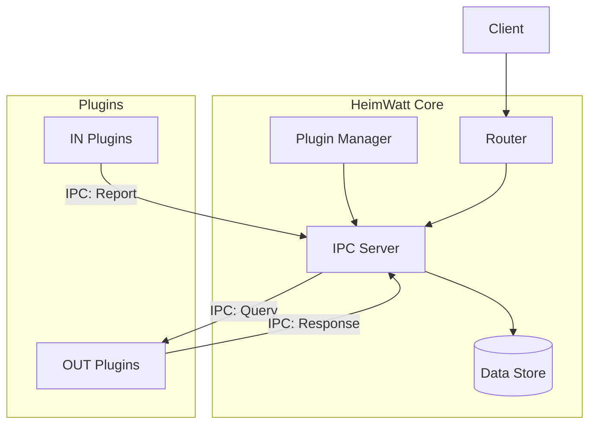

# HeimWatt System Design

> **Status**: Conceptual / In-Development

## Vision

HeimWatt is an extensible data platform designed to optimize energy usage. Its core philosophy is **separation of concerns** between data ingestion, storage, and computation.

1.  **Ingest**: Collect time-series data from diverse sources (APIs, sensors) into a unified semantic format.
2.  **Store**: Persist data in a strongly-typed, queryable store.
3.  **Compute**: Run optimization algorithms (e.g., Linear Programming) on stored data to generate strategies.
4.  **Act**: Expose strategies and controls via a unified API.

The system is designed to be **modular**, **robust**, and **language-agnostic** (via IPC), though the core is implemented in C for performance and stability.

---

## Architectural Principles

1.  **Core as Broker**: The Core application does not know about specific weather APIs or energy markets. It acts purely as a broker that manages plugins, stores data, and routes requests.
2.  **Semantic Data**: All data is exchanged using **Semantic Types** (e.g., `ATMOSPHERE_TEMPERATURE`, `ENERGY_PRICE_SPOT`). This allows plugins to interoperate without knowing about each other's existence. A solver plugin requests "Temperature" without caring if it came from SMHI or OpenMeteo.
3.  **Plugin Isolation**: Extensions run as separate processes. They communicate with Core via a strict IPC protocol. This ensures that a crashing plugin cannot take down the main system.
4.  **Opaque APIs**: Internal module state is hidden. Modules interact via opaque handles and defined functions, never by direct struct access.

---

## System Architecture

The system consists of the **Core** process and a set of **Plugin** processes.

### Data Flow

1.  **Ingestion**: An **IN Plugin** (e.g., Weather Provider) wakes up, fetches data from an external API, normalizes it to SI units, and pushes it to Core via `REPORT` IPC messages.
2.  **Storage**: Core verifies the message and stores it in the **Data Store**, indexed by Semantic Type and Timestamp.
3.  **Request**: A client requests an optimization strategy via HTTP.
4.  **Routing**: The **Router** identifies the registered endpoint and forwards the request to the responsible **OUT Plugin** (e.g., Strategy Solver) via `HTTP_REQUEST` IPC message.
5.  **Computation**: The OUT Plugin receives the request. It queries Core for necessary inputs (e.g., historical prices, battery state) using `QUERY` IPC messages.
6.  **Response**: The OUT Plugin computes the result and sends it back to Core, which forwards it to the client.

---

## Module Concepts

### Core
The central orchestrator. It has no domain knowledge of energy or weather.
-   **Lifecycle**: Manages startup, shutdown, and the main event loop.
-   **Config**: Loads runtime configuration.
-   **Plugin Manager**: Discovers, forks, and monitors plugin processes. Handles restarts on failure.
-   **Router**: Maps external HTTP requests to internal Plugin IDs.

### Data Store
A semantic time-series database wrapper.
-   **Tier 1 Data**: Well-known, strongly-typed semantic data (Enum ID + Value + Timestamp). Fast and indexable.
-   **Tier 2 Data**: "Raw" extension data (String Key + JSON Blob + Timestamp) for flexible, unstructured logging.
-   **Persistence**: Backed by a relational database (SQLite) but exposed purely as a time-series store.

### Network
Handles external communication.
-   **HTTP Server**: Accepts client connections.
-   **IPC Server**: Domain socket server for efficient, local process-to-process communication.

### Plugins
External executables that provide the actual functionality. A plugin can be:
-   **IN**: A data source (Producer).
-   **OUT**: A calculator or service (Consumer/Responder).

---

## Protocols

### IPC Protocol
Communication between Core and Plugins happens over Unix Domain Sockets using newline-delimited JSON.

**Key Message Types**:
-   `HELLO`: Handshake identifying the plugin.
-   `REPORT`: Send a data point (IN Plugins).
-   `QUERY`: Request data points (OUT Plugins).
-   `REGISTER_ENDPOINT`: Claim an HTTP route (OUT Plugins).
-   `HTTP_REQUEST` / `HTTP_RESPONSE`: Proxying web traffic.

### API & Semantic Types
Data is unified by the **Semantic Type System**.
-   **Domains**: `atmosphere`, `solar`, `energy`, `storage`, etc.
-   **Normalization**: All values are stored in canonical SI units (e.g., Celsius, Pascals, kWh). Currency is handled as a value/code pair (e.g., `100.50`, `SEK`).

---

## Plugin SDK
To simplify plugin development, a C SDK is provided. It abstracts the IPC protocol.
-   **Context**: Manages the connection and event loop.
-   **Builder API**: Fluent API for constructing and sending reports.
-   **Registration**: Simple functions to bind callbacks to HTTP routes.

The SDK ensures that plugins remain thin and focused on their specific logic (fetching data or solving math).
