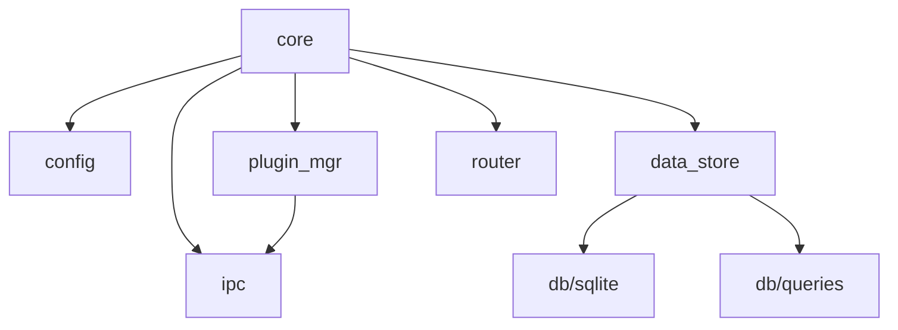

# Core Module Design

> **Version**: 3.0 (2026-01-14)  
> **Status**: ✅ API Defined  
> **Scope**: Central broker, orchestration, routing

---

## Overview

The **Core** module is the central nervous system of HeimWatt. It ties together all other modules and manages the system lifecycle.

**Core does NOT**:
- Convert units (SDK/Plugin responsibility)
- Perform business logic (OUT Plugin responsibility)
- Solve optimization problems (OUT Plugin responsibility)

**Core DOES**:
- Manage plugin lifecycles (fork, supervise, restart)
- Store semantic-typed data
- Route API requests to OUT plugins
- Handle IPC with all plugins

---

## Module Breakdown

```
src/core/
├── core.h / core.c         # System lifecycle
├── config.h / config.c     # Configuration parsing
├── plugin_mgr.h / plugin_mgr.c   # Plugin management
├── data_store.h / data_store.c   # Data storage abstraction
├── router.h / router.c           # HTTP routing
└── ipc.h / ipc.c                 # IPC server
```

---

## API Definitions

### core.h — System Lifecycle

Orchestrates startup, shutdown, and main loop.

> **Source**: [src/core/core.h](../../../../src/core/core.h)

**Behavior**:
- `core_init()`: Load config, open database, start IPC server, scan plugins
- `core_run()`: Start HTTP server, start plugins, enter event loop
- `core_shutdown()`: Signal all plugins to stop, close connections
- `core_destroy()`: Free all resources

---

### config.h — Configuration

Parses `heimwatt.json`.

> **Source**: [src/core/config.h](../../../../src/core/config.h)

**Config File Format** (`heimwatt.json`):
```json
{
  "database": "./data.db",
  "plugins_dir": "./plugins",
  "ipc_socket": "/tmp/heimwatt.sock",
  "http_port": 8080,
  "plugin_timeout_ms": 5000,
  "plugin_max_restarts": 3
}
```

---

### plugin_mgr.h — Plugin Lifecycle

Discovers, forks, and supervises plugins.

> **Source**: [src/core/plugin_mgr.h](../../../../src/core/plugin_mgr.h)

**Plugin Discovery**:
1. Scan `plugins/in/` and `plugins/out/` directories
2. Look for `manifest.json` in each subdirectory
3. Parse manifest, validate required fields
4. Add to internal registry

**Plugin Startup**:
1. `fork()` new process
2. Child: `execve()` the plugin binary with IPC socket path
3. Parent: Record PID, establish IPC connection

---

### data_store.h — Semantic Data Storage

High-level API for storing/querying semantic data.

> **Source**: [src/core/data_store.h](../../../../src/core/data_store.h)

**Threading**: All operations are thread-safe (internal locking).

---

### router.h — Request Routing

Maps HTTP paths to plugin IDs.

> **Source**: [src/core/router.h](../../../../src/core/router.h)

**Route Matching**:
- Exact match: `GET /api/energy-strategy`
- No wildcards in v1 (can add later)

---

### ipc.h — Core-Side IPC

Unix domain socket server for plugin communication.

> **Source**: [src/core/ipc.h](../../../../src/core/ipc.h)

**Protocol**: JSON messages, newline-delimited. See [architecture.md](../architecture.md) for message types.

---

## Dependency Graph



---

## Error Handling

All functions return `int`:
- `0` = Success
- `-1` = Error (check `errno` or module-specific error)

Opaque pointer outputs are set to `NULL` on failure.

---

> **Document Map**:
> - [Architecture Overview](../architecture.md)
> - [Plugin System](../plugins/design.md)
> - [Network Stack](../net/design.md)
> - [Database Layer](../db/design.md)
