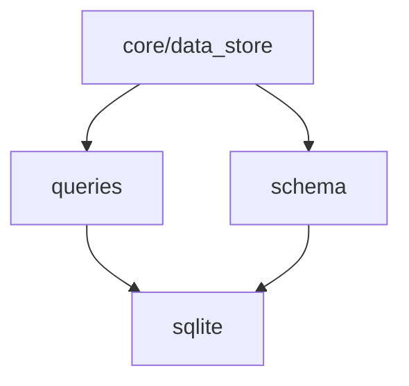

# Database Layer Design

> **Version**: 3.0 (2026-01-14)  
> **Status**: ✅ API Defined  
> **Scope**: SQLite wrapper, schema, named queries

---

## Overview

The **Database Layer** provides atomic modules for all database operations. SQLite is the underlying engine.

```
src/db/
├── sqlite.h / sqlite.c     # Connection wrapper
├── schema.h / schema.c     # Schema creation/migration
└── queries.h / queries.c   # Named prepared statements
```

---

## Module Breakdown

### Dependency Graph



---

### sqlite.h — SQLite Wrapper

Low-level wrapper around SQLite3. Hides SQLite types from the rest of the codebase.

> **Source**: [src/db/sqlite.h](../../../../src/db/sqlite.h)

---

## schema.h — Schema Management

Table creation and migrations.

> **Source**: [src/db/schema.h](../../../../src/db/schema.h)

### Schema Definition

**Version 1**:

```sql
-- Tier 1: Known semantic types
CREATE TABLE IF NOT EXISTS tier1_data (
    id INTEGER PRIMARY KEY AUTOINCREMENT,
    timestamp INTEGER NOT NULL,
    semantic_type INTEGER NOT NULL,  -- Enum from semantic_types.h
    value REAL NOT NULL,
    currency TEXT,                   -- ISO 4217 code (nullable)
    source_id TEXT NOT NULL,         -- Plugin ID
    created_at INTEGER DEFAULT (strftime('%s', 'now'))
);

CREATE INDEX IF NOT EXISTS idx_tier1_semantic_ts 
    ON tier1_data(semantic_type, timestamp DESC);

CREATE INDEX IF NOT EXISTS idx_tier1_source 
    ON tier1_data(source_id);

-- Tier 2: Raw extension data
CREATE TABLE IF NOT EXISTS tier2_data (
    id INTEGER PRIMARY KEY AUTOINCREMENT,
    timestamp INTEGER NOT NULL,
    key TEXT NOT NULL,               -- "vendor.sensor_name"
    json_payload TEXT,
    source_id TEXT NOT NULL,
    created_at INTEGER DEFAULT (strftime('%s', 'now'))
);

CREATE INDEX IF NOT EXISTS idx_tier2_key_ts 
    ON tier2_data(key, timestamp DESC);

-- Schema version tracking
CREATE TABLE IF NOT EXISTS schema_version (
    version INTEGER PRIMARY KEY
);

INSERT OR IGNORE INTO schema_version (version) VALUES (1);
```

---

### queries.h — Named Queries

Prepared statement wrappers for common operations.

> **Source**: [src/db/queries.h](../../../../src/db/queries.h)

---

## Usage Examples

### Basic Operations

```c
#include "db/sqlite.h"
#include "db/schema.h"
#include "db/queries.h"

int main(void) {
    db_conn *conn;
    
    // Open database
    if (db_open(&conn, "./heimwatt.db") != DB_OK) {
        fprintf(stderr, "Failed to open database\n");
        return 1;
    }
    
    // Initialize schema
    if (schema_init(conn) != DB_OK) {
        fprintf(stderr, "Schema init failed: %s\n", db_errmsg(conn));
        db_close(&conn);
        return 1;
    }
    
    // Insert data
    query_insert_tier1(conn, 
                       SEM_ATMOSPHERE_TEMPERATURE,
                       time(NULL),
                       15.5,
                       NULL,  // Not monetary
                       "com.heimwatt.smhi");
    
    // Query latest
    double value;
    int64_t ts;
    char currency[4];
    char source[256];
    
    if (query_select_latest_tier1(conn, SEM_ATMOSPHERE_TEMPERATURE,
                                   &value, &ts, currency, source) == DB_OK) {
        printf("Temperature: %.1f°C from %s\n", value, source);
    }
    
    db_close(&conn);
    return 0;
}
```

### Range Query

```c
double *values;
int64_t *timestamps;
char **currencies;
size_t count;

int64_t now = time(NULL);
int64_t yesterday = now - 86400;

if (query_select_range_tier1(conn, SEM_ENERGY_PRICE_SPOT,
                              yesterday, now,
                              &values, &timestamps, &currencies,
                              &count) == DB_OK) {
    for (size_t i = 0; i < count; i++) {
        printf("Price at %lld: %.2f %s\n", 
               timestamps[i], values[i], 
               currencies[i] ? currencies[i] : "???");
    }
    
    query_free_range_tier1(values, timestamps, currencies, count);
}
```

### Transactions

```c
db_begin(conn);

for (int i = 0; i < 1000; i++) {
    query_insert_tier1(conn, SEM_ATMOSPHERE_TEMPERATURE,
                       base_ts + i * 3600, temps[i], NULL, source);
}

if (/* success */) {
    db_commit(conn);
} else {
    db_rollback(conn);
}
```

---

## Thread Safety

- **db_conn**: NOT thread-safe. Use one connection per thread, or serialize access.
- **db_stmt**: Bound to connection, NOT thread-safe.

For multi-threaded access, use a connection pool (future enhancement) or serialize with mutex.

---

## Performance Notes

1. **Batch inserts**: Use transactions (30-100x faster)
2. **Indexes**: Queries on `(semantic_type, timestamp)` are O(log n)
3. **WAL mode**: Default, allows concurrent reads during write

---

> **Document Map**:
> - [Architecture Overview](../architecture.md)
> - [Core Module](../core/design.md)
