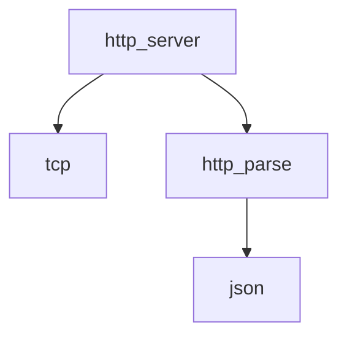

# Network Stack Design

> **Version**: 3.0 (2026-01-14)  
> **Status**: ✅ API Defined  
> **Scope**: TCP, HTTP parsing, HTTP server, JSON utilities

---

## Overview

The **Network Stack** provides atomic, composable modules for handling all network operations. Each module has a single purpose.

```
src/net/
├── tcp.h / tcp.c           # Raw socket operations
├── http_parse.h / http_parse.c   # HTTP request/response parsing
├── http_server.h / http_server.c # HTTP server (accept loop)
└── json.h / json.c               # JSON encode/decode
```

---

## Module Breakdown

### Dependency Graph



---

### tcp_server.h / tcp_client.h — Raw Socket Operations

Lowest level of the network stack. Pure POSIX socket operations.

> **Source**: [src/net/tcp_server.h](../../../../src/net/tcp_server.h), [src/net/tcp_client.h](../../../../src/net/tcp_client.h)

**Error Handling**:
- Returns `-1` on error, sets `errno`
- Returns bytes read/written on success (for I/O operations)
- Returns `0` on connection closed (recv)

---

### http_parse.h — HTTP Parsing

Stateless HTTP/1.1 request and response parsing.

> **Source**: [src/net/http_parse.h](../../../../src/net/http_parse.h)

**Status Code Reasons**:
```c
// Automatically set by http_response_set_status()
200 -> "OK"
201 -> "Created"
204 -> "No Content"
400 -> "Bad Request"
401 -> "Unauthorized"
404 -> "Not Found"
500 -> "Internal Server Error"
```

---

### http_server.h — HTTP Server

Accept loop and request dispatching. Uses `tcp` and `http_parse` modules.

> **Source**: [src/net/http_server.h](../../../../src/net/http_server.h)

**Threading Model**:
- Main thread runs accept loop
- Each connection spawned in new thread (or thread pool)
- Handler is called once per request

**Default Behavior**:
- If no handler set, returns 404 for all requests
- Connection timeout: 30 seconds
- Max connections: 100

---

### json.h — JSON Utilities

JSON parsing and serialization. Thin wrapper (can use cJSON internally).

> **Source**: [src/net/json.h](../../../../src/net/json.h)

---

## Usage Examples

> **See [Network Tutorial](../../../../tutorials/network.md) for usage examples.**

---

## Error Codes

| Module | Error | Meaning |
|--------|-------|---------|
| tcp | `EAGAIN` | Non-blocking I/O would block |
| tcp | `ECONNRESET` | Connection reset by peer |
| http_parse | `-1` | Malformed HTTP |
| json | `NULL` | Parse error |

---

> **Document Map**:
> - [Architecture Overview](../architecture.md)
> - [Core Module](../core/design.md)
