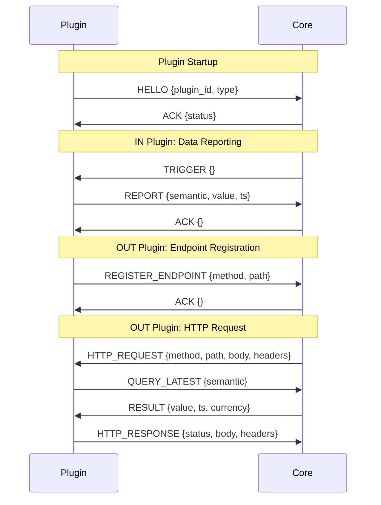

# Plugin System Design

> **Version**: 3.0 (2026-01-14)  
> **Status**: ✅ API Defined  
> **Scope**: Plugin lifecycle, SDK, IPC protocol

---

## Overview

The **Plugin System** manages the extension ecosystem of HeimWatt. Plugins are forked subprocesses that communicate with Core via IPC.

**Key Concepts**:
1. **Two Plugin Types**: 
   - **IN Plugins**: Fetch data from external sources (inbound)
   - **OUT Plugins**: Compute answers and serve API endpoints (outbound)
2. **Semantic Types**: Data is exchanged using strongly-typed vocabulary
3. **Core as Broker**: Plugins do not talk to each other; they communicate via Core

---

## Directory Structure

```
plugins/
├── in/                         # IN Plugins (data ingest)
│   ├── smhi/
│   │   ├── smhi.c
│   │   ├── manifest.json
│   │   └── Makefile
│   ├── elpriset/
│   │   ├── elpriset.c
│   │   ├── manifest.json
│   │   └── Makefile
│   └── openmeteo/
│       ├── openmeteo.c
│       ├── manifest.json
│       └── Makefile
│
└── out/                        # OUT Plugins (compute + serve)
    └── energy_strategy/
        ├── strategy.c
        ├── lps.h / lps.c       # LPS solver
        ├── manifest.json
        └── Makefile
```

---

## IN Plugins (Inbound Data)

### Purpose

Fetch data from external APIs, sensors, or hardware. Report to Core.

### Responsibilities

1. Fetch data from external source
2. Convert to **canonical SI units**
3. Apply constraints (floor/cap)
4. Report to Core via SDK

### Lifecycle

```
1. Core forks plugin process
2. Plugin: sdk_init()
3. Plugin: sdk_run() — enters event loop
4. Core: sends TRIGGER message (scheduled or on-demand)
5. Plugin: fetches data, calls sdk_metric_*().report()
6. Plugin: sdk_fini() on shutdown
```

### Example: SMHI Weather Plugin

> **See [Plugin Development Tutorial](../../../../tutorials/plugins.md) for implementation examples.**

### Manifest

```json
{
  "id": "com.heimwatt.smhi",
  "type": "in",
  "name": "SMHI Weather",
  "version": "1.0.0",
  "binary": "smhi",
  "provides": {
    "known": ["ATMOSPHERE_TEMPERATURE", "ATMOSPHERE_HUMIDITY", "ATMOSPHERE_CLOUD_COVER"],
    "raw": ["smhi.wind_direction", "smhi.precipitation_category"]
  },
  "schedule": {
    "interval_seconds": 3600,
    "on_startup": true
  }
}
```

---

## OUT Plugins (Outbound Compute)

### Purpose

Query data from Core, perform calculations, serve results via HTTP endpoints.

### Responsibilities

1. Register HTTP endpoints
2. Declare data dependencies
3. Query data from Core
4. Compute results (e.g., optimization)
5. Return JSON responses

### Lifecycle

```
1. Core forks plugin process
2. Plugin: sdk_init()
3. Plugin: sdk_register_endpoint() for each route
4. Plugin: sdk_require_semantic() to declare dependencies
5. Plugin: sdk_run() — enters event loop
6. Core: forwards HTTP_REQUEST when endpoint is hit
7. Plugin: queries data, computes, sends HTTP_RESPONSE
8. Plugin: sdk_fini() on shutdown
```

### Example: Energy Strategy Plugin

> **See [Plugin Development Tutorial](../../../../tutorials/plugins.md) for implementation examples.**

### Manifest

```json
{
  "id": "com.heimwatt.energy-strategy",
  "type": "out",
  "name": "48h Energy Strategy",
  "version": "1.0.0",
  "binary": "energy_strategy",
  "requires": {
    "known": ["ENERGY_PRICE_SPOT", "STORAGE_SOC"]
  },
  "optional": {
    "known": ["SOLAR_GHI", "ATMOSPHERE_CLOUD_COVER"]
  },
  "endpoints": [
    { "method": "GET", "path": "/api/energy-strategy" }
  ],
  "triggers": {
    "on_data": ["ENERGY_PRICE_SPOT"],
    "interval_seconds": 900
  }
}
```

---

## Manifest Schema

### Common Fields

| Field | Type | Required | Description |
|-------|------|----------|-------------|
| `id` | string | ✅ | Unique identifier (reverse domain) |
| `type` | `"in"` or `"out"` | ✅ | Plugin type |
| `name` | string | ✅ | Human-readable name |
| `version` | string | ✅ | Semantic version |
| `binary` | string | ✅ | Executable name (in plugin dir) |

### IN Plugin Fields

| Field | Type | Required | Description |
|-------|------|----------|-------------|
| `provides.known` | string[] | ✅ | Semantic types provided |
| `provides.raw` | string[] | ❌ | Tier 2 keys provided |
| `schedule.interval_seconds` | int | ❌ | Fetch interval |
| `schedule.on_startup` | bool | ❌ | Trigger immediately on start |

### OUT Plugin Fields

| Field | Type | Required | Description |
|-------|------|----------|-------------|
| `requires.known` | string[] | ✅ | Required semantic types |
| `optional.known` | string[] | ❌ | Optional semantic types |
| `endpoints` | object[] | ✅ | HTTP endpoints to register |
| `triggers.on_data` | string[] | ❌ | Semantic types that trigger recompute |
| `triggers.interval_seconds` | int | ❌ | Periodic recompute interval |

---

## IPC Protocol

JSON over Unix domain socket. Newline-delimited messages.

### Message Types



### Message Formats

**HELLO** (Plugin → Core):
```json
{"type":"HELLO","plugin_id":"com.heimwatt.smhi","plugin_type":"in"}
```

**REPORT** (IN Plugin → Core):
```json
{"type":"REPORT","semantic":"ATMOSPHERE_TEMPERATURE","value":15.5,"ts":1705262400}
```

**REPORT_RAW** (IN Plugin → Core):
```json
{"type":"REPORT_RAW","key":"smhi.wind_direction","json":"{\"degrees\":180}","ts":1705262400}
```

**QUERY_LATEST** (OUT Plugin → Core):
```json
{"type":"QUERY_LATEST","semantic":"ENERGY_PRICE_SPOT"}
```

**RESULT** (Core → Plugin):
```json
{"type":"RESULT","value":0.85,"currency":"SEK","ts":1705262400}
```

**QUERY_RANGE** (OUT Plugin → Core):
```json
{"type":"QUERY_RANGE","semantic":"ENERGY_PRICE_SPOT","from":1705262400,"to":1705435200}
```

**RESULT_ARRAY** (Core → Plugin):
```json
{"type":"RESULT_ARRAY","points":[{"value":0.85,"ts":1705262400},{"value":0.92,"ts":1705266000}]}
```

**REGISTER_ENDPOINT** (OUT Plugin → Core):
```json
{"type":"REGISTER_ENDPOINT","method":"GET","path":"/api/energy-strategy"}
```

**HTTP_REQUEST** (Core → OUT Plugin):
```json
{"type":"HTTP_REQUEST","id":"req-123","method":"GET","path":"/api/energy-strategy","query":"?horizon=48","headers":{"Accept":"application/json"},"body":""}
```

**HTTP_RESPONSE** (OUT Plugin → Core):
```json
{"type":"HTTP_RESPONSE","id":"req-123","status":200,"headers":{"Content-Type":"application/json"},"body":"{...}"}
```

**TRIGGER** (Core → IN Plugin):
```json
{"type":"TRIGGER","reason":"scheduled"}
```

**ACK** (Core → Plugin):
```json
{"type":"ACK","status":"ok"}
```

**ERROR** (Either direction):
```json
{"type":"ERROR","code":"INVALID_SEMANTIC","message":"Unknown semantic type"}
```

---

## Security Model

### Process Isolation

- Each plugin runs as a separate process (forked)
- Plugins do not share memory with Core
- Plugins cannot access each other's data directly

### Future: Sandboxing

- `seccomp` filters to restrict system calls
- Allowlist-based network access (per manifest)
- Resource limits via `cgroups`

### Plugin Signing (Future)

- Plugins can be signed with GPG keys
- Core verifies signatures before loading
- Unsigned plugins require explicit user approval

---

## Error Handling

### Plugin Crash

1. Core detects plugin exit (SIGCHLD)
2. Log error with exit code
3. Restart plugin (up to `plugin_max_restarts`)
4. If max restarts exceeded, mark as FAILED, log alert

### Plugin Timeout

1. Core sends request with timeout
2. If no response, send SIGTERM
3. Wait grace period, then SIGKILL
4. Restart plugin

### Dependency Failure

- OUT plugin requires data not provided by any IN plugin
- Core rejects plugin at validation time
- Error logged, plugin not started

---

> **Document Map**:
> - [Architecture Overview](../architecture.md)
> - [Core Module](../core/design.md)
> - [SDK Design](../sdk/design.md)
