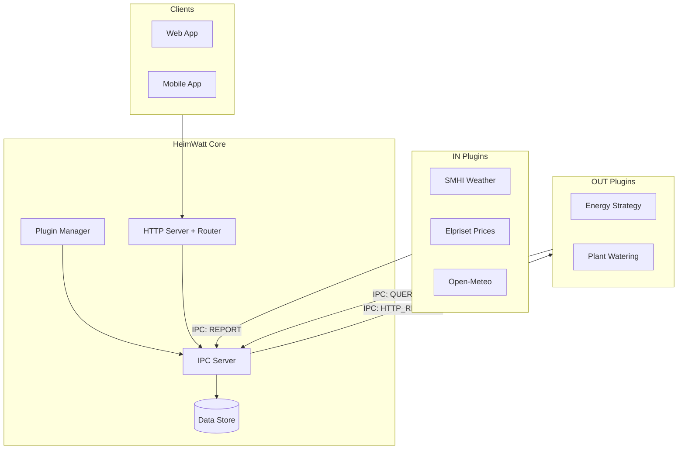
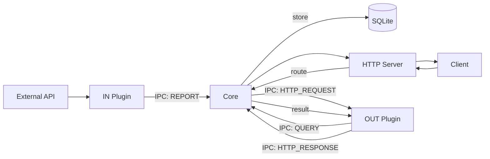

# HeimWatt: System Architecture

> **Version**: 3.0 (2026-01-14)  
> **Status**: ✅ Module Architecture Defined

---

## Vision

**HeimWatt** is an extensible data platform that:
1. **Ingests** time-series data from external APIs and sensors via plugins
2. **Stores** data indexed by semantic type
3. **Computes** answers to optimization questions via calculator plugins
4. **Exposes** results through a REST API

---

## Core Design Decisions

| Decision | Resolution |
|----------|------------|
| Data normalization | Plugins send data in canonical SI units. SDK validates, does not convert. |
| Plugin architecture | Two types: **IN Plugins** (ingest) and **OUT Plugins** (compute + serve) |
| Core responsibility | Pure data broker: store, index, route. No domain logic. |
| Extensibility | Tier 1 (known semantic types) + Tier 2 (raw extension data) |
| Currency handling | Value + currency code string. No conversion. Client displays. |
| IPC mechanism | JSON over Unix domain sockets. Plugins are forked subprocesses. |
| Modularity | Atomic modules: each `.c`/`.h` pair has a single, defined purpose. |

---

## System Architecture



---

## Source Tree

```
heimwatt/
├── include/                        # Public API headers
│   ├── types.h                     # Core typedefs, forward decls
│   ├── semantic_types.h            # Semantic type enum + metadata
│   └── heimwatt_sdk.h              # Plugin SDK (shipped to plugin devs)
│
├── src/
│   ├── main.c                      # Entry point only
│   │
│   ├── core/                       # Central broker
│   │   ├── core.h / core.c         # Lifecycle, orchestration
│   │   ├── config.h / config.c     # Configuration parsing
│   │   ├── plugin_mgr.h / plugin_mgr.c   # Plugin discovery, fork, supervise
│   │   ├── data_store.h / data_store.c   # Semantic data storage
│   │   ├── router.h / router.c           # HTTP → plugin dispatch
│   │   └── ipc.h / ipc.c                 # Core-side IPC
│   │
│   ├── net/                        # Network stack (to TCP)
│   │   ├── tcp.h / tcp.c           # Raw socket ops
│   │   ├── http_parse.h / http_parse.c   # HTTP request/response parsing
│   │   ├── http_server.h / http_server.c # HTTP server (accept loop)
│   │   └── json.h / json.c               # JSON encode/decode
│   │
│   ├── db/                         # Database layer
│   │   ├── sqlite.h / sqlite.c     # Connection wrapper
│   │   ├── schema.h / schema.c     # Table creation/migration
│   │   └── queries.h / queries.c   # Prepared statements
│   │
│   ├── sdk/                        # SDK implementation (libheimwatt-sdk.so)
│   │   ├── sdk_core.h / sdk_core.c       # Plugin context lifecycle
│   │   ├── sdk_report.h / sdk_report.c   # Data reporting (builder)
│   │   ├── sdk_query.h / sdk_query.c     # Query API
│   │   ├── sdk_endpoint.h / sdk_endpoint.c # Endpoint registration
│   │   └── sdk_ipc.h / sdk_ipc.c         # Plugin-side IPC
│   │
│   └── util/                       # Shared utilities
│       ├── log.h / log.c           # Logging
│       ├── time_util.h / time_util.c     # Timestamp helpers
│       ├── signal_util.h / signal_util.c # Signal handling
│       └── mem.h / mem.c                 # Allocation helpers
│
├── plugins/
│   ├── in/                         # IN Plugins (data ingest)
│   │   ├── smhi/
│   │   ├── elpriset/
│   │   └── openmeteo/
│   │
│   └── out/                        # OUT Plugins (compute + serve)
│       └── energy_strategy/        # 48h optimal energy strategy + LPS solver
│
├── libs/                           # Vendored third-party libraries
│   ├── cJSON/                      # JSON parsing
│   ├── sqlite3/                    # SQLite database engine
│   └── curl/                       # HTTP client (for plugins)
│
├── webui/                          # Web UI (React, future)
│   ├── public/
│   ├── src/
│   └── package.json
│
├── config/                         # Runtime configuration
│   ├── heimwatt.json               # Main config file
│   └── plugins.d/                  # Per-plugin config overrides
│
├── data/                           # Runtime data
│   ├── heimwatt.db                 # SQLite database
│   └── cache/                      # Plugin cache files
│
├── logs/                           # Log files
│   ├── heimwatt.log                # Main log
│   └── plugins/                    # Per-plugin logs
│
├── var/                            # Runtime state
│   └── heimwatt.sock               # IPC socket
│
└── docs/design/modules/
    ├── core/design.md
    ├── plugins/design.md
    ├── net/design.md
    ├── db/design.md
    └── sdk/design.md
```

---

## Plugin Types

### IN Plugins (Inbound Data)

**Purpose**: Fetch data from external sources, report to Core.

**Lifecycle**:
```
sdk_init() → sdk_run() → [REPORT loop] → sdk_fini()
```

**Example Usage**:
```c
sdk_metric_new(ctx)
    ->semantic(SEM_ATMOSPHERE_TEMPERATURE)
    ->value(15.5)
    ->floor(-50.0)
    ->report();
```

**Manifest**:
```json
{
  "type": "in",
  "id": "com.heimwatt.smhi",
  "provides": {
    "known": ["ATMOSPHERE_TEMPERATURE", "ATMOSPHERE_HUMIDITY"],
    "raw": ["smhi.wind_direction"]
  },
  "schedule": { "interval_seconds": 3600 }
}
```

### OUT Plugins (Outbound Compute)

**Purpose**: Query data, compute answers, serve via API endpoint.

**Lifecycle**:
```
sdk_init() → sdk_register_endpoint() → sdk_run() → [handle requests] → sdk_fini()
```

**Example Usage**:
```c
sdk_register_endpoint(ctx, "GET", "/api/energy-strategy", handle_strategy);

int handle_strategy(plugin_ctx *ctx, const sdk_request *req, sdk_response *resp) {
    sdk_data_point price;
    sdk_query_latest(ctx, SEM_ENERGY_PRICE_SPOT, &price);
    
    // Compute 48h strategy using LPS solver...
    
    sdk_response_json(resp, strategy_json);
    return 0;
}
```

**Manifest**:
```json
{
  "type": "out",
  "id": "com.heimwatt.energy-strategy",
  "requires": { "known": ["ENERGY_PRICE_SPOT", "STORAGE_SOC"] },
  "endpoints": [{ "method": "GET", "path": "/api/energy-strategy" }],
  "triggers": { "on_data": ["ENERGY_PRICE_SPOT"], "interval_seconds": 900 }
}
```

---

## Semantic Type System

### Hierarchy

```
<domain>.<measurement>[.<qualifier>]
```

### Domains

| Domain | Examples |
|--------|----------|
| `atmosphere` | temperature, humidity, pressure, precipitation |
| `solar` | ghi, dni, dhi, elevation |
| `space` | kp_index, solar_wind, xray_flux |
| `energy` | price.spot, grid_frequency, carbon_intensity |
| `storage` | soc, power, voltage, temperature |
| `vehicle` | soc, charging.power, charging.state |
| `soil` | temperature, moisture |
| `water` | temperature, ph, level, flow |
| `indoor` | temperature, humidity, co2, illuminance |
| `air` | aqi, pm2_5, pm10, no2 |

### Two-Tier Model

| Tier | Purpose | Validation |
|------|---------|------------|
| **Tier 1** | Known semantic types (enum) | Full: type, unit, format |
| **Tier 2** | Raw extension data (string key) | Minimal: key format only |

---

## IPC Protocol

JSON over Unix domain socket. Each message is newline-terminated.

### Message Types

| Direction | Type | Purpose |
|-----------|------|---------|
| Plugin → Core | `REPORT` | Submit Tier 1 data point |
| Plugin → Core | `REPORT_RAW` | Submit Tier 2 data |
| Plugin → Core | `QUERY_LATEST` | Request latest value |
| Plugin → Core | `QUERY_RANGE` | Request historical range |
| Plugin → Core | `REGISTER_ENDPOINT` | Declare HTTP endpoint |
| Core → Plugin | `HTTP_REQUEST` | Forward HTTP request to OUT plugin |
| Plugin → Core | `HTTP_RESPONSE` | Return HTTP response |
| Core → Plugin | `TRIGGER` | Wake plugin (scheduled/data event) |

---

## Data Flow



---

## Core Components

| Component | Responsibility |
|-----------|----------------|
| **Plugin Manager** | Discover, fork, supervise plugin processes |
| **Data Store** | SQLite, indexed by semantic type + timestamp |
| **Router** | Map HTTP paths → plugin IDs |
| **HTTP Server** | Accept connections, parse HTTP, dispatch |
| **IPC Server** | Unix socket, JSON messages, Core ↔ Plugin |
| **SDK** | Plugin library: reporting, querying, endpoints |

---

## Document Index

| Path | Description |
|------|-------------|
| [architecture.md](./architecture.md) | This file — system overview |
| [modules/core/design.md](./modules/core/design.md) | Core module APIs |
| [modules/plugins/design.md](./modules/plugins/design.md) | Plugin system design |
| [modules/net/design.md](./modules/net/design.md) | Network stack APIs |
| [modules/db/design.md](./modules/db/design.md) | Database layer APIs |
| [modules/sdk/design.md](./modules/sdk/design.md) | SDK public API |

---

## Next Steps

1. ✅ Define module APIs (this document + children)
2. [ ] Create stub implementations for all modules
3. [ ] Implement Core lifecycle (`core.c`)
4. [ ] Implement IPC server/client
5. [ ] Port existing LPS logic to `energy_strategy` plugin
6. [ ] Build first IN plugin (SMHI or Elpriset)
