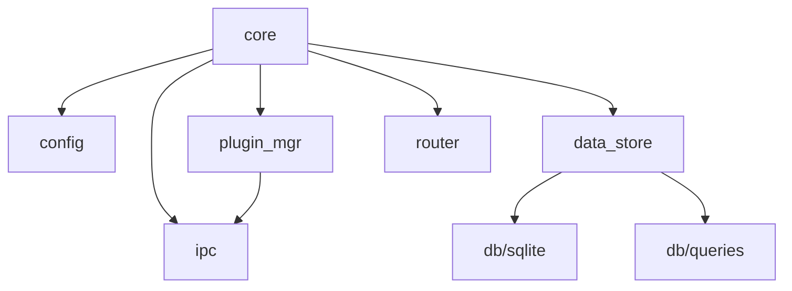

# Core Module Design

> **Version**: 3.0 (2026-01-14)  
> **Status**: ✅ API Defined  
> **Scope**: Central broker, orchestration, routing

---

## Overview

The **Core** module is the central nervous system of HeimWatt. It ties together all other modules and manages the system lifecycle.

**Core does NOT**:
- Convert units (SDK/Plugin responsibility)
- Perform business logic (OUT Plugin responsibility)
- Solve optimization problems (OUT Plugin responsibility)

**Core DOES**:
- Manage plugin lifecycles (fork, supervise, restart)
- Store semantic-typed data
- Route API requests to OUT plugins
- Handle IPC with all plugins

---

## Module Breakdown

```
src/core/
├── core.h / core.c         # System lifecycle
├── config.h / config.c     # Configuration parsing
├── plugin_mgr.h / plugin_mgr.c   # Plugin management
├── data_store.h / data_store.c   # Data storage abstraction
├── router.h / router.c           # HTTP routing
└── ipc.h / ipc.c                 # IPC server
```

---

## API Definitions

### core.h — System Lifecycle

Orchestrates startup, shutdown, and main loop.

```c
#ifndef HEIMWATT_CORE_H
#define HEIMWATT_CORE_H

#include "types.h"
#include <stdbool.h>

typedef struct heimwatt_ctx heimwatt_ctx;

// Lifecycle
int  core_init(heimwatt_ctx **ctx, const char *config_path);
int  core_run(heimwatt_ctx *ctx);   // Blocks until shutdown
void core_shutdown(heimwatt_ctx *ctx);
void core_destroy(heimwatt_ctx **ctx);

// Status
bool core_is_running(const heimwatt_ctx *ctx);

#endif
```

**Behavior**:
- `core_init()`: Load config, open database, start IPC server, scan plugins
- `core_run()`: Start HTTP server, start plugins, enter event loop
- `core_shutdown()`: Signal all plugins to stop, close connections
- `core_destroy()`: Free all resources

---

### config.h — Configuration

Parses `heimwatt.json`.

```c
#ifndef HEIMWATT_CONFIG_H
#define HEIMWATT_CONFIG_H

typedef struct {
    char *database_path;        // "./data.db"
    char *plugins_dir;          // "./plugins"
    char *ipc_socket_path;      // "/tmp/heimwatt.sock"
    int   http_port;            // 8080
    int   plugin_timeout_ms;    // 5000
    int   plugin_max_restarts;  // 3
} heimwatt_config;

int  config_load(heimwatt_config *cfg, const char *path);
void config_destroy(heimwatt_config *cfg);
void config_init_defaults(heimwatt_config *cfg);

#endif
```

**Config File Format** (`heimwatt.json`):
```json
{
  "database": "./data.db",
  "plugins_dir": "./plugins",
  "ipc_socket": "/tmp/heimwatt.sock",
  "http_port": 8080,
  "plugin_timeout_ms": 5000,
  "plugin_max_restarts": 3
}
```

---

### plugin_mgr.h — Plugin Lifecycle

Discovers, forks, and supervises plugins.

```c
#ifndef HEIMWATT_PLUGIN_MGR_H
#define HEIMWATT_PLUGIN_MGR_H

#include "types.h"
#include <stdbool.h>

typedef struct plugin_mgr plugin_mgr;
typedef struct plugin_handle plugin_handle;

typedef enum {
    PLUGIN_TYPE_IN,     // Data plugin (inbound)
    PLUGIN_TYPE_OUT     // Calculator plugin (outbound)
} plugin_type;

typedef enum {
    PLUGIN_STATE_STOPPED,
    PLUGIN_STATE_STARTING,
    PLUGIN_STATE_RUNNING,
    PLUGIN_STATE_FAILED
} plugin_state;

// Manager lifecycle
int  plugin_mgr_init(plugin_mgr **mgr, const char *plugins_dir, 
                     const char *ipc_sock);
void plugin_mgr_destroy(plugin_mgr **mgr);

// Discovery & loading
int  plugin_mgr_scan(plugin_mgr *mgr);          // Find all manifest.json
int  plugin_mgr_validate(plugin_mgr *mgr);      // Check dependencies
int  plugin_mgr_start_all(plugin_mgr *mgr);     // Fork all plugins
void plugin_mgr_stop_all(plugin_mgr *mgr);      // Graceful shutdown

// Individual plugin control
int  plugin_mgr_start(plugin_mgr *mgr, const char *plugin_id);
int  plugin_mgr_stop(plugin_mgr *mgr, const char *plugin_id);
int  plugin_mgr_restart(plugin_mgr *mgr, const char *plugin_id);

// Query
plugin_handle *plugin_mgr_get(plugin_mgr *mgr, const char *plugin_id);
plugin_state   plugin_handle_state(const plugin_handle *h);
plugin_type    plugin_handle_type(const plugin_handle *h);
const char    *plugin_handle_id(const plugin_handle *h);
pid_t          plugin_handle_pid(const plugin_handle *h);

// Iterate
typedef void (*plugin_iter_fn)(const plugin_handle *h, void *userdata);
void plugin_mgr_foreach(plugin_mgr *mgr, plugin_iter_fn fn, void *userdata);

// Supervision (called from main loop)
int plugin_mgr_check_health(plugin_mgr *mgr);   // Restart dead plugins

#endif
```

**Plugin Discovery**:
1. Scan `plugins/in/` and `plugins/out/` directories
2. Look for `manifest.json` in each subdirectory
3. Parse manifest, validate required fields
4. Add to internal registry

**Plugin Startup**:
1. `fork()` new process
2. Child: `execve()` the plugin binary with IPC socket path
3. Parent: Record PID, establish IPC connection

---

### data_store.h — Semantic Data Storage

High-level API for storing/querying semantic data.

```c
#ifndef HEIMWATT_DATA_STORE_H
#define HEIMWATT_DATA_STORE_H

#include "semantic_types.h"
#include <stddef.h>
#include <stdint.h>

typedef struct data_store data_store;

// Lifecycle
int  data_store_open(data_store **ds, const char *db_path);
void data_store_close(data_store **ds);

// --- Tier 1: Known semantic types ---

typedef struct {
    int64_t     timestamp;
    double      value;
    char        currency[4];    // Optional ISO code (empty if not monetary)
    const char *source_id;      // Plugin ID
} data_point;

int data_store_insert(data_store *ds, semantic_type type, 
                      const data_point *pt);

int data_store_query_latest(data_store *ds, semantic_type type,
                            data_point *out);

int data_store_query_range(data_store *ds, semantic_type type,
                           int64_t from_ts, int64_t to_ts,
                           data_point **out, size_t *count);

void data_store_free_points(data_point *pts);

// --- Tier 2: Raw extension data ---

int data_store_insert_raw(data_store *ds, const char *key,
                          int64_t timestamp, const char *json_payload,
                          const char *source_id);

int data_store_query_raw_latest(data_store *ds, const char *key,
                                char **json_out, int64_t *ts_out);

#endif
```

**Threading**: All operations are thread-safe (internal locking).

---

### router.h — Request Routing

Maps HTTP paths to plugin IDs.

```c
#ifndef HEIMWATT_ROUTER_H
#define HEIMWATT_ROUTER_H

#include "types.h"
#include <stdbool.h>

typedef struct router router;

// Lifecycle
int  router_init(router **r);
void router_destroy(router **r);

// Registration (called when OUT plugins declare endpoints)
int router_register(router *r, const char *method, const char *path,
                    const char *plugin_id);

int router_unregister(router *r, const char *plugin_id);

// Dispatch (returns plugin_id or NULL if not found)
const char *router_lookup(router *r, const char *method, const char *path);

// Check if route exists
bool router_has_route(router *r, const char *method, const char *path);

// Debug
void router_dump(const router *r);  // Log all routes

#endif
```

**Route Matching**:
- Exact match: `GET /api/energy-strategy`
- No wildcards in v1 (can add later)

---

### ipc.h — Core-Side IPC

Unix domain socket server for plugin communication.

```c
#ifndef HEIMWATT_IPC_H
#define HEIMWATT_IPC_H

#include <stddef.h>

typedef struct ipc_server ipc_server;
typedef struct ipc_conn ipc_conn;

// Server lifecycle
int  ipc_server_init(ipc_server **srv, const char *socket_path);
void ipc_server_destroy(ipc_server **srv);

// Accept connection (blocks until connection or error)
int ipc_server_accept(ipc_server *srv, ipc_conn **conn);

// Connection operations
int  ipc_conn_recv(ipc_conn *conn, char **msg, size_t *len);  // Caller frees
int  ipc_conn_send(ipc_conn *conn, const char *msg, size_t len);
void ipc_conn_close(ipc_conn **conn);

// Connection identification
void ipc_conn_set_plugin_id(ipc_conn *conn, const char *plugin_id);
const char *ipc_conn_plugin_id(const ipc_conn *conn);

// File descriptors (for poll/select/epoll)
int ipc_server_fd(const ipc_server *srv);
int ipc_conn_fd(const ipc_conn *conn);

#endif
```

**Protocol**: JSON messages, newline-delimited. See [architecture.md](../architecture.md) for message types.

---

## Dependency Graph



---

## Error Handling

All functions return `int`:
- `0` = Success
- `-1` = Error (check `errno` or module-specific error)

Opaque pointer outputs are set to `NULL` on failure.

---

> **Document Map**:
> - [Architecture Overview](../architecture.md)
> - [Plugin System](../plugins/design.md)
> - [Network Stack](../net/design.md)
> - [Database Layer](../db/design.md)
