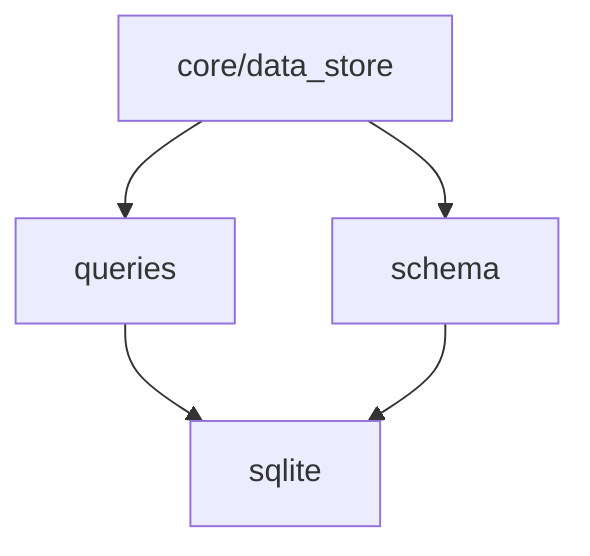

# Database Layer Design

> **Version**: 3.0 (2026-01-14)  
> **Status**: ✅ API Defined  
> **Scope**: SQLite wrapper, schema, named queries

---

## Overview

The **Database Layer** provides atomic modules for all database operations. SQLite is the underlying engine.

```
src/db/
├── sqlite.h / sqlite.c     # Connection wrapper
├── schema.h / schema.c     # Schema creation/migration
└── queries.h / queries.c   # Named prepared statements
```

---

## Module Breakdown

### Dependency Graph



---

## sqlite.h — SQLite Wrapper

Low-level wrapper around SQLite3. Hides SQLite types from the rest of the codebase.

```c
#ifndef HEIMWATT_SQLITE_H
#define HEIMWATT_SQLITE_H

#include <stdint.h>
#include <stddef.h>

typedef struct db_conn db_conn;
typedef struct db_stmt db_stmt;

// Error codes (compatible with SQLite)
#define DB_OK       0
#define DB_ERROR    1
#define DB_ROW      100   // sqlite3_step() has another row
#define DB_DONE     101   // sqlite3_step() is complete

// ============================================================
// CONNECTION
// ============================================================

// Open database (creates if not exists)
int db_open(db_conn **conn, const char *path);

// Close database
void db_close(db_conn **conn);

// Execute SQL without result (for DDL, inserts)
int db_exec(db_conn *conn, const char *sql);

// Get last error message
const char *db_errmsg(const db_conn *conn);

// Get last insert rowid
int64_t db_last_insert_id(const db_conn *conn);

// Get affected row count
int db_changes(const db_conn *conn);

// ============================================================
// PREPARED STATEMENTS
// ============================================================

// Prepare a statement
int db_prepare(db_conn *conn, const char *sql, db_stmt **stmt);

// Finalize (free) a statement
void db_finalize(db_stmt **stmt);

// Reset statement for re-use
int db_reset(db_stmt *stmt);

// Clear bindings
int db_clear_bindings(db_stmt *stmt);

// ============================================================
// BINDING (1-indexed)
// ============================================================

int db_bind_int(db_stmt *stmt, int idx, int64_t val);
int db_bind_double(db_stmt *stmt, int idx, double val);
int db_bind_text(db_stmt *stmt, int idx, const char *val);
int db_bind_blob(db_stmt *stmt, int idx, const void *data, size_t len);
int db_bind_null(db_stmt *stmt, int idx);

// ============================================================
// EXECUTION
// ============================================================

// Step through results
// Returns DB_ROW (more data), DB_DONE (finished), or error
int db_step(db_stmt *stmt);

// ============================================================
// COLUMN ACCESS (0-indexed, after db_step returns DB_ROW)
// ============================================================

int         db_column_count(const db_stmt *stmt);
int         db_column_type(const db_stmt *stmt, int col);
int64_t     db_column_int(const db_stmt *stmt, int col);
double      db_column_double(const db_stmt *stmt, int col);
const char *db_column_text(const db_stmt *stmt, int col);
const void *db_column_blob(const db_stmt *stmt, int col, size_t *len);
int         db_column_is_null(const db_stmt *stmt, int col);

// Column type constants
#define DB_TYPE_INTEGER 1
#define DB_TYPE_FLOAT   2
#define DB_TYPE_TEXT    3
#define DB_TYPE_BLOB    4
#define DB_TYPE_NULL    5

// ============================================================
// TRANSACTIONS
// ============================================================

int db_begin(db_conn *conn);
int db_commit(db_conn *conn);
int db_rollback(db_conn *conn);

#endif
```

---

## schema.h — Schema Management

Table creation and migrations.

```c
#ifndef HEIMWATT_SCHEMA_H
#define HEIMWATT_SCHEMA_H

#include "sqlite.h"

// Initialize schema (creates tables if not exist)
// Idempotent: safe to call on every startup
int schema_init(db_conn *conn);

// Get current schema version
int schema_version(db_conn *conn);

// Migrate to target version
int schema_migrate(db_conn *conn, int target_version);

// Current schema version constant
#define SCHEMA_VERSION_CURRENT 1

#endif
```

### Schema Definition

**Version 1**:

```sql
-- Tier 1: Known semantic types
CREATE TABLE IF NOT EXISTS tier1_data (
    id INTEGER PRIMARY KEY AUTOINCREMENT,
    timestamp INTEGER NOT NULL,
    semantic_type INTEGER NOT NULL,  -- Enum from semantic_types.h
    value REAL NOT NULL,
    currency TEXT,                   -- ISO 4217 code (nullable)
    source_id TEXT NOT NULL,         -- Plugin ID
    created_at INTEGER DEFAULT (strftime('%s', 'now'))
);

CREATE INDEX IF NOT EXISTS idx_tier1_semantic_ts 
    ON tier1_data(semantic_type, timestamp DESC);

CREATE INDEX IF NOT EXISTS idx_tier1_source 
    ON tier1_data(source_id);

-- Tier 2: Raw extension data
CREATE TABLE IF NOT EXISTS tier2_data (
    id INTEGER PRIMARY KEY AUTOINCREMENT,
    timestamp INTEGER NOT NULL,
    key TEXT NOT NULL,               -- "vendor.sensor_name"
    json_payload TEXT,
    source_id TEXT NOT NULL,
    created_at INTEGER DEFAULT (strftime('%s', 'now'))
);

CREATE INDEX IF NOT EXISTS idx_tier2_key_ts 
    ON tier2_data(key, timestamp DESC);

-- Schema version tracking
CREATE TABLE IF NOT EXISTS schema_version (
    version INTEGER PRIMARY KEY
);

INSERT OR IGNORE INTO schema_version (version) VALUES (1);
```

---

## queries.h — Named Queries

Prepared statement wrappers for common operations.

```c
#ifndef HEIMWATT_QUERIES_H
#define HEIMWATT_QUERIES_H

#include "sqlite.h"
#include "semantic_types.h"
#include <stdint.h>
#include <stddef.h>

// ============================================================
// TIER 1: KNOWN SEMANTIC TYPES
// ============================================================

// Insert a data point
int query_insert_tier1(db_conn *conn, 
                       semantic_type type,
                       int64_t timestamp,
                       double value,
                       const char *currency,    // Can be NULL
                       const char *source_id);

// Get most recent value for a semantic type
// Returns DB_OK if found, DB_DONE if no data
int query_select_latest_tier1(db_conn *conn,
                              semantic_type type,
                              double *out_value,
                              int64_t *out_timestamp,
                              char *out_currency,    // Buffer, min 4 bytes
                              char *out_source);     // Buffer, min 256 bytes

// Get values in time range
// Caller must free *out_values and *out_timestamps
int query_select_range_tier1(db_conn *conn,
                             semantic_type type,
                             int64_t from_ts,
                             int64_t to_ts,
                             double **out_values,
                             int64_t **out_timestamps,
                             char ***out_currencies,  // Array of strings
                             size_t *out_count);

// Free range query results
void query_free_range_tier1(double *values, int64_t *timestamps,
                            char **currencies, size_t count);

// Get distinct sources for a semantic type
int query_select_sources_tier1(db_conn *conn,
                               semantic_type type,
                               char ***out_sources,
                               size_t *out_count);

// Delete old data (before timestamp)
int query_delete_before_tier1(db_conn *conn,
                              semantic_type type,
                              int64_t before_ts);

// ============================================================
// TIER 2: RAW EXTENSION DATA
// ============================================================

// Insert raw data
int query_insert_tier2(db_conn *conn,
                       const char *key,
                       int64_t timestamp,
                       const char *json_payload,
                       const char *source_id);

// Get most recent raw data
// Caller must free *out_json
int query_select_latest_tier2(db_conn *conn,
                              const char *key,
                              char **out_json,
                              int64_t *out_timestamp);

// Get raw data in time range
int query_select_range_tier2(db_conn *conn,
                             const char *key,
                             int64_t from_ts,
                             int64_t to_ts,
                             char ***out_json,
                             int64_t **out_timestamps,
                             size_t *out_count);

// Free range query results
void query_free_range_tier2(char **json, int64_t *timestamps, size_t count);

// ============================================================
// AGGREGATION
// ============================================================

// Get count of records for a semantic type
int query_count_tier1(db_conn *conn, semantic_type type, size_t *out_count);

// Get time range bounds
int query_time_bounds_tier1(db_conn *conn, semantic_type type,
                            int64_t *out_min_ts, int64_t *out_max_ts);

// Get average value in range
int query_avg_tier1(db_conn *conn, semantic_type type,
                    int64_t from_ts, int64_t to_ts,
                    double *out_avg);

#endif
```

---

## Usage Examples

### Basic Operations

```c
#include "db/sqlite.h"
#include "db/schema.h"
#include "db/queries.h"

int main(void) {
    db_conn *conn;
    
    // Open database
    if (db_open(&conn, "./heimwatt.db") != DB_OK) {
        fprintf(stderr, "Failed to open database\n");
        return 1;
    }
    
    // Initialize schema
    if (schema_init(conn) != DB_OK) {
        fprintf(stderr, "Schema init failed: %s\n", db_errmsg(conn));
        db_close(&conn);
        return 1;
    }
    
    // Insert data
    query_insert_tier1(conn, 
                       SEM_ATMOSPHERE_TEMPERATURE,
                       time(NULL),
                       15.5,
                       NULL,  // Not monetary
                       "com.heimwatt.smhi");
    
    // Query latest
    double value;
    int64_t ts;
    char currency[4];
    char source[256];
    
    if (query_select_latest_tier1(conn, SEM_ATMOSPHERE_TEMPERATURE,
                                   &value, &ts, currency, source) == DB_OK) {
        printf("Temperature: %.1f°C from %s\n", value, source);
    }
    
    db_close(&conn);
    return 0;
}
```

### Range Query

```c
double *values;
int64_t *timestamps;
char **currencies;
size_t count;

int64_t now = time(NULL);
int64_t yesterday = now - 86400;

if (query_select_range_tier1(conn, SEM_ENERGY_PRICE_SPOT,
                              yesterday, now,
                              &values, &timestamps, &currencies,
                              &count) == DB_OK) {
    for (size_t i = 0; i < count; i++) {
        printf("Price at %lld: %.2f %s\n", 
               timestamps[i], values[i], 
               currencies[i] ? currencies[i] : "???");
    }
    
    query_free_range_tier1(values, timestamps, currencies, count);
}
```

### Transactions

```c
db_begin(conn);

for (int i = 0; i < 1000; i++) {
    query_insert_tier1(conn, SEM_ATMOSPHERE_TEMPERATURE,
                       base_ts + i * 3600, temps[i], NULL, source);
}

if (/* success */) {
    db_commit(conn);
} else {
    db_rollback(conn);
}
```

---

## Thread Safety

- **db_conn**: NOT thread-safe. Use one connection per thread, or serialize access.
- **db_stmt**: Bound to connection, NOT thread-safe.

For multi-threaded access, use a connection pool (future enhancement) or serialize with mutex.

---

## Performance Notes

1. **Batch inserts**: Use transactions (30-100x faster)
2. **Indexes**: Queries on `(semantic_type, timestamp)` are O(log n)
3. **WAL mode**: Default, allows concurrent reads during write

---

> **Document Map**:
> - [Architecture Overview](../architecture.md)
> - [Core Module](../core/design.md)
