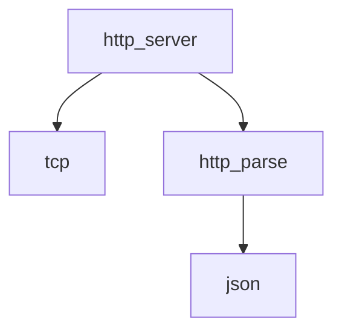

# Network Stack Design

> **Version**: 3.0 (2026-01-14)  
> **Status**: ✅ API Defined  
> **Scope**: TCP, HTTP parsing, HTTP server, JSON utilities

---

## Overview

The **Network Stack** provides atomic, composable modules for handling all network operations. Each module has a single purpose.

```
src/net/
├── tcp.h / tcp.c           # Raw socket operations
├── http_parse.h / http_parse.c   # HTTP request/response parsing
├── http_server.h / http_server.c # HTTP server (accept loop)
└── json.h / json.c               # JSON encode/decode
```

---

## Module Breakdown

### Dependency Graph



---

## tcp.h — Raw Socket Operations

Lowest level of the network stack. Pure POSIX socket operations.

```c
#ifndef HEIMWATT_TCP_H
#define HEIMWATT_TCP_H

#include <stddef.h>

typedef struct tcp_socket tcp_socket;

// Server operations
int  tcp_listen(tcp_socket **sock, int port, int backlog);
int  tcp_accept(tcp_socket *sock, tcp_socket **client);
void tcp_close(tcp_socket **sock);

// I/O (blocking)
int tcp_recv(tcp_socket *sock, char *buf, size_t len);
int tcp_send(tcp_socket *sock, const char *buf, size_t len);

// Non-blocking I/O
int tcp_recv_nonblock(tcp_socket *sock, char *buf, size_t len);
int tcp_send_nonblock(tcp_socket *sock, const char *buf, size_t len);

// Configuration
int tcp_set_nonblocking(tcp_socket *sock, int enable);
int tcp_set_reuseaddr(tcp_socket *sock, int enable);
int tcp_set_nodelay(tcp_socket *sock, int enable);

// Info
int tcp_fd(const tcp_socket *sock);
int tcp_peer_addr(const tcp_socket *sock, char *buf, size_t len);
int tcp_local_port(const tcp_socket *sock);

#endif
```

**Error Handling**:
- Returns `-1` on error, sets `errno`
- Returns bytes read/written on success (for I/O operations)
- Returns `0` on connection closed (recv)

---

## http_parse.h — HTTP Parsing

Stateless HTTP/1.1 request and response parsing.

```c
#ifndef HEIMWATT_HTTP_PARSE_H
#define HEIMWATT_HTTP_PARSE_H

#include <stddef.h>

// Maximum sizes
#define HTTP_MAX_METHOD   16
#define HTTP_MAX_PATH     2048
#define HTTP_MAX_HEADERS  64
#define HTTP_MAX_HEADER_NAME  64
#define HTTP_MAX_HEADER_VALUE 4096

typedef struct {
    char method[HTTP_MAX_METHOD];       // "GET", "POST", etc.
    char path[HTTP_MAX_PATH];           // "/api/plan"
    char query[HTTP_MAX_PATH];          // "foo=bar" (without '?')
    
    // Headers
    struct {
        char name[HTTP_MAX_HEADER_NAME];
        char value[HTTP_MAX_HEADER_VALUE];
    } headers[HTTP_MAX_HEADERS];
    size_t header_count;
    
    // Body
    char  *body;        // Heap-allocated, caller frees
    size_t body_len;
} http_request;

typedef struct {
    int status_code;    // 200, 404, etc.
    
    // Headers
    struct {
        char name[HTTP_MAX_HEADER_NAME];
        char value[HTTP_MAX_HEADER_VALUE];
    } headers[HTTP_MAX_HEADERS];
    size_t header_count;
    
    // Body
    char  *body;        // Heap-allocated, caller frees
    size_t body_len;
} http_response;

// Parse raw HTTP request
// Returns 0 on success, -1 on parse error
int http_parse_request(const char *raw, size_t len, http_request *req);

// Serialize HTTP response to wire format
// Caller frees *out
int http_serialize_response(const http_response *resp, char **out, size_t *out_len);

// Header helpers
const char *http_request_header(const http_request *req, const char *name);
void http_response_set_header(http_response *resp, const char *name, 
                               const char *value);

// Convenience: set JSON body with Content-Type header
void http_response_set_json(http_response *resp, const char *json);

// Convenience: set status with reason phrase
void http_response_set_status(http_response *resp, int code);

// Cleanup
void http_request_destroy(http_request *req);
void http_response_destroy(http_response *resp);

// Initialize (zero out)
void http_request_init(http_request *req);
void http_response_init(http_response *resp);

#endif
```

**Status Code Reasons**:
```c
// Automatically set by http_response_set_status()
200 -> "OK"
201 -> "Created"
204 -> "No Content"
400 -> "Bad Request"
401 -> "Unauthorized"
404 -> "Not Found"
500 -> "Internal Server Error"
```

---

## http_server.h — HTTP Server

Accept loop and request dispatching. Uses `tcp` and `http_parse` modules.

```c
#ifndef HEIMWATT_HTTP_SERVER_H
#define HEIMWATT_HTTP_SERVER_H

#include "http_parse.h"

typedef struct http_server http_server;

// Handler callback signature
// Return 0 on success, -1 on error (will send 500)
typedef int (*http_handler_fn)(const http_request *req, http_response *resp, 
                                 void *ctx);

// Lifecycle
int  http_server_init(http_server **srv, int port);
void http_server_destroy(http_server **srv);

// Configuration
void http_server_set_handler(http_server *srv, http_handler_fn fn, void *ctx);
void http_server_set_timeout(http_server *srv, int timeout_ms);
void http_server_set_max_connections(http_server *srv, int max);

// Run (blocks until stopped)
int http_server_run(http_server *srv);

// Stop (thread-safe, can be called from signal handler)
void http_server_stop(http_server *srv);

// Status
int http_server_is_running(const http_server *srv);
int http_server_port(const http_server *srv);

#endif
```

**Threading Model**:
- Main thread runs accept loop
- Each connection spawned in new thread (or thread pool)
- Handler is called once per request

**Default Behavior**:
- If no handler set, returns 404 for all requests
- Connection timeout: 30 seconds
- Max connections: 100

---

## json.h — JSON Utilities

JSON parsing and serialization. Thin wrapper (can use cJSON internally).

```c
#ifndef HEIMWATT_JSON_H
#define HEIMWATT_JSON_H

#include <stdbool.h>
#include <stddef.h>

typedef struct json_value json_value;

// ============================================================
// PARSING
// ============================================================

// Parse JSON string. Returns NULL on error.
json_value *json_parse(const char *str);

// Free parsed value (and all children)
void json_free(json_value *v);

// ============================================================
// TYPE CHECKS
// ============================================================

bool json_is_object(const json_value *v);
bool json_is_array(const json_value *v);
bool json_is_string(const json_value *v);
bool json_is_number(const json_value *v);
bool json_is_bool(const json_value *v);
bool json_is_null(const json_value *v);

// ============================================================
// OBJECT ACCESS
// ============================================================

// Get value by key. Returns NULL if not found or not an object.
const json_value *json_get(const json_value *obj, const char *key);

// Get number of keys
size_t json_object_size(const json_value *obj);

// Iterate keys (returns key name, sets *value)
const char *json_object_iter(const json_value *obj, size_t index, 
                              const json_value **value);

// ============================================================
// ARRAY ACCESS
// ============================================================

size_t json_array_size(const json_value *arr);
const json_value *json_array_get(const json_value *arr, size_t idx);

// ============================================================
// VALUE EXTRACTION
// ============================================================

const char *json_string_value(const json_value *v);     // NULL if not string
double      json_number_value(const json_value *v);     // 0.0 if not number
bool        json_bool_value(const json_value *v);       // false if not bool
int64_t     json_int_value(const json_value *v);        // Cast from number

// ============================================================
// BUILDING
// ============================================================

json_value *json_object_new(void);
json_value *json_array_new(void);
json_value *json_string_new(const char *s);
json_value *json_number_new(double n);
json_value *json_bool_new(bool b);
json_value *json_null_new(void);

void json_object_set(json_value *obj, const char *key, json_value *val);
void json_object_set_string(json_value *obj, const char *key, const char *val);
void json_object_set_number(json_value *obj, const char *key, double val);
void json_object_set_bool(json_value *obj, const char *key, bool val);

void json_array_append(json_value *arr, json_value *val);

// ============================================================
// SERIALIZATION
// ============================================================

// Serialize to compact string. Caller frees.
char *json_stringify(const json_value *v);

// Serialize to pretty-printed string. Caller frees.
char *json_stringify_pretty(const json_value *v);

#endif
```

---

## Usage Examples

### Simple HTTP Server

```c
#include "net/http_server.h"
#include "net/json.h"

int handle_request(const http_request *req, http_response *resp, void *ctx) {
    if (strcmp(req->method, "GET") == 0 && strcmp(req->path, "/health") == 0) {
        http_response_set_json(resp, "{\"status\":\"ok\"}");
        return 0;
    }
    
    http_response_set_status(resp, 404);
    http_response_set_json(resp, "{\"error\":\"not found\"}");
    return 0;
}

int main(void) {
    http_server *srv;
    http_server_init(&srv, 8080);
    http_server_set_handler(srv, handle_request, NULL);
    http_server_run(srv);  // Blocks
    http_server_destroy(&srv);
    return 0;
}
```

### Raw TCP Communication

```c
#include "net/tcp.h"

int main(void) {
    tcp_socket *server;
    tcp_listen(&server, 9000, 10);
    
    while (1) {
        tcp_socket *client;
        tcp_accept(server, &client);
        
        char buf[4096];
        int n = tcp_recv(client, buf, sizeof(buf) - 1);
        if (n > 0) {
            buf[n] = '\0';
            printf("Received: %s\n", buf);
            tcp_send(client, "OK\n", 3);
        }
        
        tcp_close(&client);
    }
    
    tcp_close(&server);
    return 0;
}
```

---

## Error Codes

| Module | Error | Meaning |
|--------|-------|---------|
| tcp | `EAGAIN` | Non-blocking I/O would block |
| tcp | `ECONNRESET` | Connection reset by peer |
| http_parse | `-1` | Malformed HTTP |
| json | `NULL` | Parse error |

---

> **Document Map**:
> - [Architecture Overview](../architecture.md)
> - [Core Module](../core/design.md)
