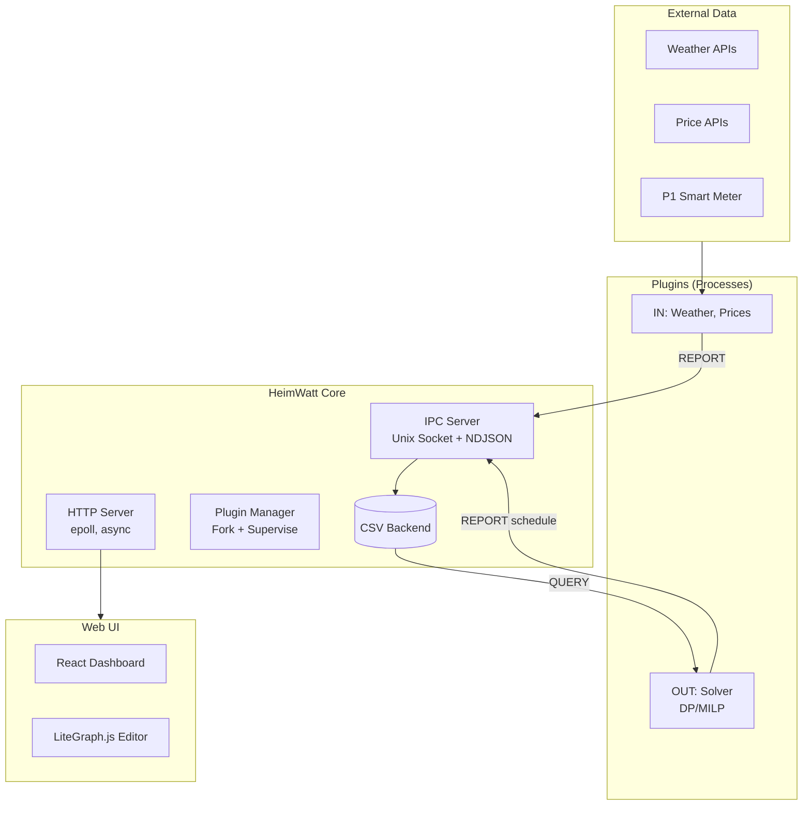

# Current State of HeimWatt

**Date:** 2026-01-20  
**Status:** Alpha / Heavy WIP

## Overview

HeimWatt is a high-performance, local-first energy optimization platform in active development. The core architecture is established as a "Pure Broker" model where the Core routing engine has zero domain knowledge, passing semantic data between decoupled plugins.

## Architecture

### Core System

| Component | Technology | Status |
|-----------|------------|--------|
| Language | C99 (Clang) | ✓ Stable |
| Event Loop | Custom epoll-based | ✓ Stable |
| IPC | Unix Domain Sockets + NDJSON | ✓ Stable |
| Storage | Wide CSV | ✓ Implemented |
| HTTP Server | Non-blocking, 1000+ connections | ✓ Stable |

### Plugin System

- **Isolation:** Plugins run as separate processes, managed by Plugin Manager
- **SDK:** C SDK provides:
  - Lifecycle management
  - Configuration from `manifest.json`
  - Scheduling (Ticks, Cron, FD events)
  - Semantic Data Reporting & Querying
  - HTTP/TLS with security policies

### Web UI

- **Stack:** React, Vite
- **Visual Programming:** LiteGraph.js for device/zone wiring
- **Status:** Scaffolding complete, node editor in progress

## Component Status

| Component | Status | Notes |
|-----------|--------|-------|
| Core Server | **Beta** | High-perf rewrite complete |
| SDK | **Beta** | All APIs implemented |
| Plugin: SMHI | **Alpha** | Weather fetching works |
| Plugin: Prices | **Planned** | Infrastructure ready |
| Solver | **Alpha** | DP scheduler implemented (mislabeled as "LPS") |
| Physics Model | **Pending** | RC Network spec ready, not implemented |
| Unit Tests | **Active** | 24+ tests passing |

## Known Issues

1. **Solver Naming**: Current "LPS" (Linear Programming Solver) is actually **Dynamic Programming** with state discretization. Rename to `dp_solver` before V1.
2. **Race Condition**: Residual risk in `http_server.c` async completion (mitigation applied)
3. **Documentation**: Legacy docs in `old_docs/` need consolidation

## Open Design Questions

- [ ] Should we integrate HiGHS for true LP/MILP (thermal dynamics)?
- [ ] How to handle SDK push messaging (server → plugin)?
- [ ] Persistent state between restarts (SQLite vs JSON)?
