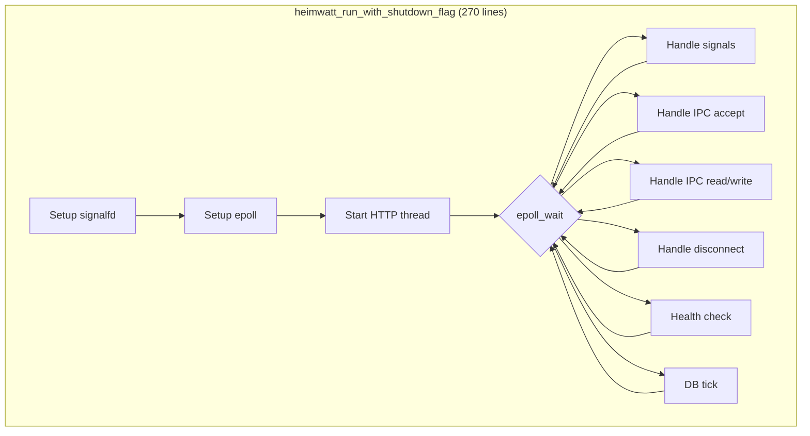
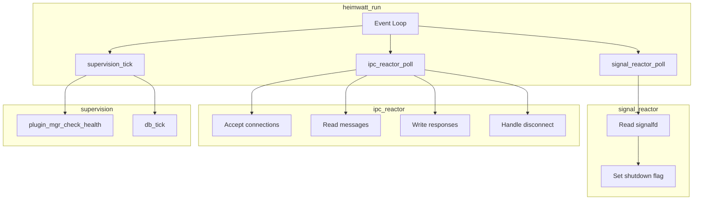

# Design Study: Core Event Loop Refactoring

> **Status**: Draft  
> **Priority**: P1  
> **Related Code**: [server.c#L451-L720](../src/server.c#L451-L720)

---

## Problem Statement

`heimwatt_run_with_shutdown_flag` is a 270-line function that orchestrates:
1. Signal handling via `signalfd`
2. epoll event loop setup
3. HTTP thread lifecycle
4. IPC connection management (accept/read/write/disconnect)
5. Periodic tasks (`plugin_mgr_check_health`, `db_tick`)

This violates the Single Responsibility Principle and creates fragility — changes to any subsystem risk breaking others.

---

## Current Architecture



---

## Proposed Architecture

### Option A: Reactor Pattern (Recommended)

Factor the monolithic loop into distinct reactors, each with a single responsibility:



**Proposed Files**:
- `src/core/signal_reactor.c` — Signal handling
- `src/core/ipc_reactor.c` — IPC event handling (refactored from inline code)
- `src/core/supervision.c` — Periodic health checks

**Benefits**:
- Each reactor is independently testable
- Clear ownership of functionality
- New reactors can be added without touching others

**Drawbacks**:
- More files to navigate
- Slightly more indirection

### Option B: Keep Monolithic with Better Organization

Keep all code in `server.c` but use static helper functions:

```c
static int handle_signal_event(heimwatt_ctx *ctx, int sfd);
static int handle_ipc_accept(heimwatt_ctx *ctx);
static int handle_ipc_event(heimwatt_ctx *ctx, ipc_conn *conn, uint32_t events);
static int handle_periodic_tasks(heimwatt_ctx *ctx);
```

**Benefits**:
- Minimal code movement
- All logic still traceable in one file

**Drawbacks**:
- Still a God File (even if not God Function)
- Harder to test individual pieces
- Coupling through shared file scope

---

## Design Decision

| Option | Complexity | Testability | Maintenance |
|--------|------------|-------------|-------------|
| **A: Reactor Pattern** | Medium | High | High |
| **B: Monolithic Helpers** | Low | Medium | Medium |

**Recommendation**: Option A

---

## Open Questions

1. Should reactors share the epoll fd or each have their own?
2. How do we handle reactor dependencies (e.g., IPC needs to check shutdown flag)?
3. Should HTTP thread be converted to a reactor or kept as a separate thread?

---

## Implementation Sketch

```
Phase 1: Extract signal handling
- Create signal_reactor.h/c
- Move signalfd setup and handling
- Test: Verify Ctrl+C still triggers clean shutdown

Phase 2: Extract IPC handling  
- Create ipc_reactor.h/c
- Move connection accept/read/write/disconnect
- Test: Verify plugins can still connect and communicate

Phase 3: Extract supervision
- Create supervision.h/c
- Move health check and db_tick
- Test: Verify plugins auto-restart on crash
```

---

## Notes

*Add iteration notes here as the design evolves.*
