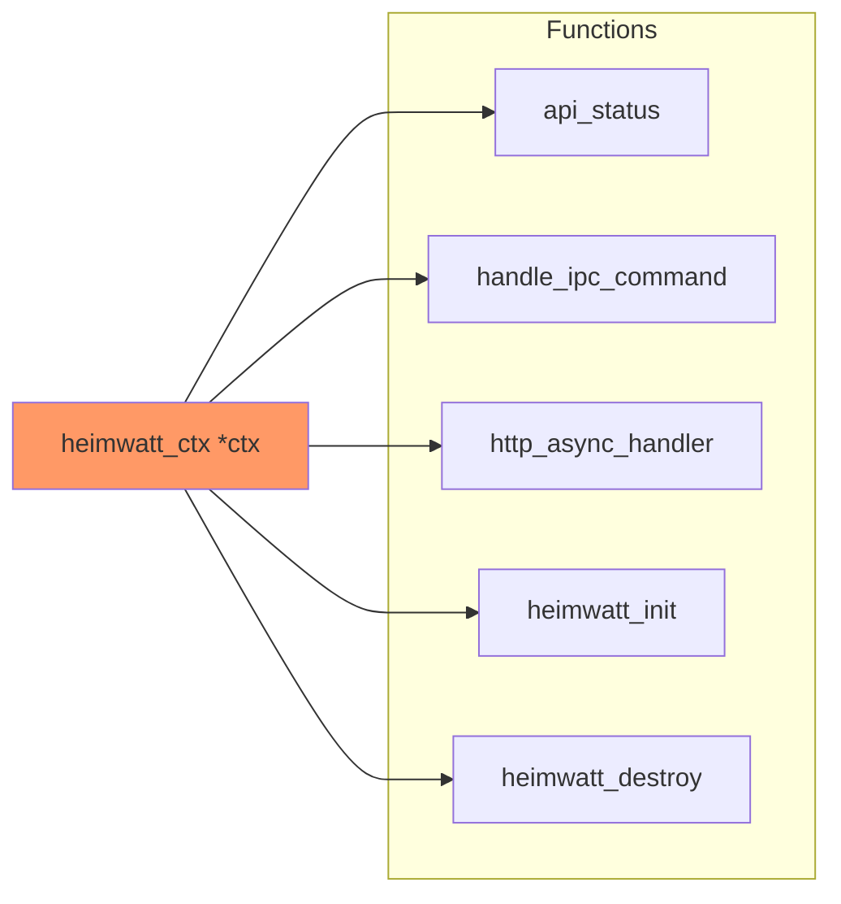
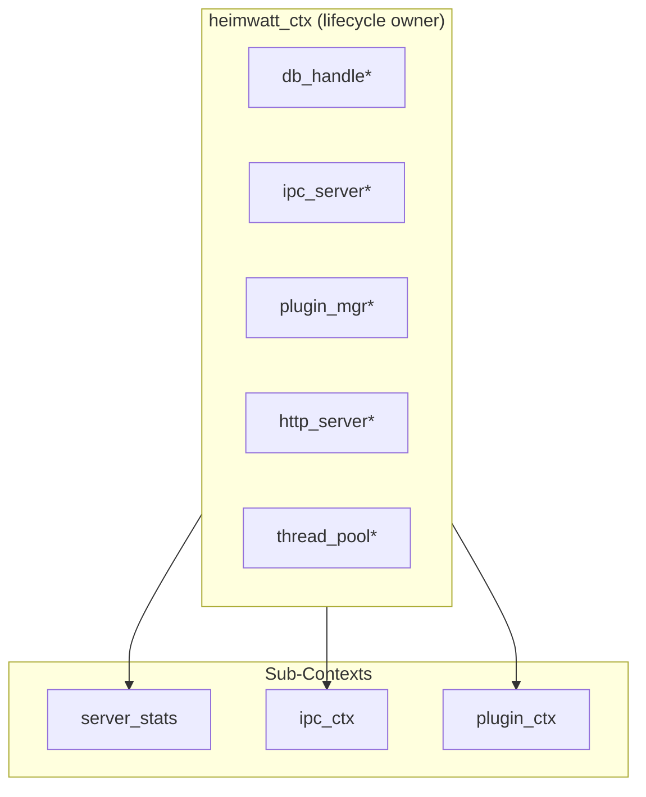

# Design Study: Context Decomposition

> **Status**: Draft  
> **Priority**: P2  
> **Related Code**: [server_internal.h#L21-L57](../src/server_internal.h#L21-L57)

---

## Problem Statement

`heimwatt_ctx` aggregates all system state into a single struct:

```c
struct heimwatt_ctx {
    db_handle *db;
    ipc_server *ipc;
    plugin_mgr *plugins;
    http_server *http;
    thread_pool *pool;
    ipc_conn *conns[MAX_PLUGIN_CONNECTIONS];
    int conn_count;
    FILE *log_file;
    // ... registry, config, etc.
};
```

Every function receiving `heimwatt_ctx *ctx` has access to the *entire* system, creating:
- Implicit coupling (function modifying connections can also access database)
- Testing difficulty (must mock entire context)
- Violation of Interface Segregation Principle

---

## Current Usage Pattern



All functions receive the same "God Context" even though they only need subsets of it.

---

## Proposed Architecture

### Option A: Sub-Contexts (Recommended)

Break the monolithic context into purpose-specific sub-contexts:



**Sub-Context Definitions**:

```c
// For read-only status queries (API handlers)
typedef struct {
    int conn_count;
    int plugin_count;
    time_t uptime_start;
} server_stats;

// For IPC command handlers
typedef struct {
    db_handle *db;
    plugin_mgr *plugins;
    ipc_conn **conns;
    int *conn_count;
    pthread_mutex_t *conn_lock;
} ipc_ctx;

// For plugin-related operations
typedef struct {
    plugin_mgr *plugins;
    const char *ipc_sock_path;
} plugin_ctx;
```

**Function Signatures**:

```c
// Before
void api_status(heimwatt_ctx *ctx, http_response *resp);

// After  
void api_status(const server_stats *stats, http_response *resp);
```

**Benefits**:
- Functions only receive what they need
- Explicit dependencies, easier testing
- Compiler enforces access restrictions via `const`

**Drawbacks**:
- More parameter passing
- Need to construct sub-contexts at call sites

### Option B: Keep Unified Context

Keep `heimwatt_ctx` as-is, rely on discipline to not access unrelated fields.

**Benefits**:
- No code changes
- Simpler initialization

**Drawbacks**:
- Implicit coupling persists
- Testing remains difficult
- No compiler enforcement

---

## Design Decision

| Aspect | Option A | Option B |
|--------|----------|----------|
| Coupling | Explicit | Implicit |
| Testability | High | Low |
| Refactoring Risk | Medium | None |
| Long-term Maintenance | Better | Status quo |

**Recommendation**: Option A for new code, gradual migration for existing code.

---

## Open Questions

1. Should sub-contexts be passed by value (copy) or by pointer (reference)?
2. How deep should the decomposition go? (e.g., should `ipc_ctx` be further split?)
3. Should sub-contexts be opaque or transparent structs?

---

## Migration Strategy

```
Phase 1: Define sub-context types
- Add types to server_internal.h
- No functional changes

Phase 2: New functions use sub-contexts
- All new API handlers receive sub-contexts
- Existing handlers unchanged

Phase 3: Gradual migration
- Convert existing handlers one at a time
- Each conversion is a small, testable PR
```

---

## Notes

*Add iteration notes here as the design evolves.*
