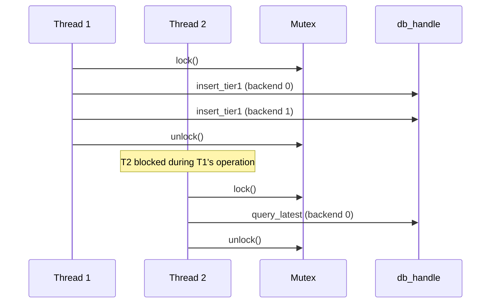

# Design Study: Database Concurrency

> **Status**: Draft  
> **Priority**: P0 (contains bug fix)  
> **Related Code**: [db.c](../src/db/db.c)

---

## Problem Statement

### Bug: Missing Lock (P0)

`db_query_point_exists_tier1` accesses the backend without acquiring the mutex:

```c
int db_query_point_exists_tier1(db_handle *db, semantic_type type, int64_t timestamp)
{
    if (!db || db->count == 0) return -EINVAL;
    return db->backends[0].ops->query_point_exists_tier1(db->backends[0].ctx, type, timestamp);
    //     ^^^^^^^^^^^^ No pthread_mutex_lock()
}
```

All other query functions (`db_query_latest_tier1`, `db_query_range_tier1`, `db_query_latest_tier2`) correctly acquire the lock. This is a data race.

### Design Question: Locking Granularity

The database uses a single `pthread_mutex_t` that serializes *all* reads and writes across *all* backends:

```c
struct db_handle {
    db_backend *backends;
    size_t count;
    pthread_mutex_t lock;  // Single mutex for everything
};
```

This is simple but may become a bottleneck if:
- A network backend with high latency is added
- Write volume increases significantly

---

## Current Architecture



---

## Proposed Solutions

### Option A: Fix Bug, Keep Coarse Lock (Recommended)

Add the missing lock to `db_query_point_exists_tier1`:

```c
int db_query_point_exists_tier1(db_handle *db, semantic_type type, int64_t timestamp)
{
    if (!db || db->count == 0) return -EINVAL;
    pthread_mutex_lock(&db->lock);
    int ret = db->backends[0].ops->query_point_exists_tier1(db->backends[0].ctx, type, timestamp);
    pthread_mutex_unlock(&db->lock);
    return ret;
}
```

**Benefits**:
- Minimal change, fixes the bug
- Simple to understand
- Sufficient for 1-2 backends with fast I/O

**Drawbacks**:
- Potential bottleneck with slow backends
- All operations serialized

### Option B: Read-Write Lock

Replace `pthread_mutex_t` with `pthread_rwlock_t`:

```c
struct db_handle {
    db_backend *backends;
    size_t count;
    pthread_rwlock_t rwlock;  // Allows concurrent reads
};
```

- Reads: `pthread_rwlock_rdlock()` — multiple readers allowed
- Writes: `pthread_rwlock_wrlock()` — exclusive access

**Benefits**:
- Concurrent reads
- Small change from current design

**Drawbacks**:
- Still serializes writes
- Writer starvation possible under heavy read load

### Option C: Per-Backend Locks

Each backend gets its own mutex:

```c
struct db_backend {
    const storage_ops *ops;
    void *ctx;
    char uri[256];
    bool is_primary;
    pthread_mutex_t lock;  // Per-backend lock
};
```

**Benefits**:
- Maximum parallelism
- Different backends can operate independently

**Drawbacks**:
- Lock ordering complexity (potential deadlocks during multi-backend writes)
- Each function must manage multiple locks
- Significant code complexity increase

---

## Design Decision

| Option | Complexity | Safety | Performance |
|--------|------------|--------|-------------|
| **A: Coarse Lock** | Low | ✅ Fixed | Sufficient |
| **B: RW Lock** | Medium | ✅ | Better reads |
| **C: Per-Backend** | High | Risk | Maximum |

**Recommendation**: Option A for now. Document that coarse locking is an intentional simplicity trade-off. Revisit when network backends are added.

---

## Immediate Action Required

**Fix the bug in `db_query_point_exists_tier1`**:

```diff
 int db_query_point_exists_tier1(db_handle *db, semantic_type type, int64_t timestamp)
 {
     if (!db || db->count == 0) return -EINVAL;
+    pthread_mutex_lock(&db->lock);
-    return db->backends[0].ops->query_point_exists_tier1(db->backends[0].ctx, type, timestamp);
+    int ret = db->backends[0].ops->query_point_exists_tier1(db->backends[0].ctx, type, timestamp);
+    pthread_mutex_unlock(&db->lock);
+    return ret;
 }
```

---

## Open Questions

1. Should we add lock contention metrics to detect when coarse locking becomes a bottleneck?
2. Should `db_tick` continue using `trylock` or switch to regular `lock`?
3. When adding network backends, which locking strategy makes most sense?

---

## Notes

*Add iteration notes here as the design evolves.*
