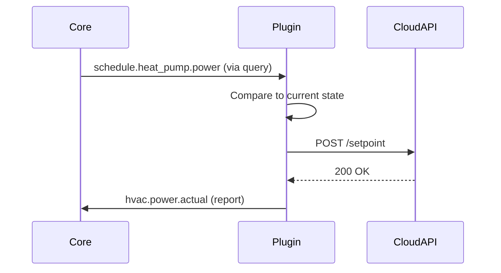

# Design Study: SDK Plugin Taxonomy

> **Status**: Draft  
> **Date**: 2026-01-20

## The Question

Is `IN`/`OUT` the correct plugin abstraction? What about sensors, actuators, constraints, API wrappers?

---

## Current Model

```
IN  Plugin  → Reports data TO core (weather, prices, meter readings)
OUT Plugin  → Queries data FROM core, computes, optionally controls devices
```

**Problem**: This binary split is too coarse. A heat pump plugin:
- **Reads** schedule from solver (OUT behavior)
- **Reports** actual power consumption (IN behavior)  
- **Controls** hardware via API (Actuator)

---

## Proposed Taxonomy

### Option A: Capability-Based (Recommended)

Plugins declare capabilities, not types:

```json
{
  "id": "com.heimwatt.melcloud",
  "capabilities": ["report", "query", "actuate"],
  "provides": ["hvac.power.actual", "hvac.cop.actual"],
  "consumes": ["schedule.heat_pump.power"],
  "controls": ["melcloud:device_id"]
}
```

| Capability | Description | Example |
|------------|-------------|---------|
| `report` | Push semantic data to Core | Weather plugin |
| `query` | Pull semantic data from Core | Solver |
| `actuate` | Control external hardware | Heat pump wrapper |
| `constrain` | Provide optimization constraints | Battery limits |
| `sense` | Real-time sensor stream | Temperature probe |

**Pros**: 
- Plugins can have multiple roles
- Core validates capability vs. behavior
- Clear audit trail ("who can actuate?")

### Option B: Role Hierarchy

```
Plugin (base)
├── DataProvider    → report only
├── DataConsumer    → query only  
├── Actuator        → query + control
├── Solver          → query + report (schedules)
└── Hybrid          → all capabilities
```

**Pros**: Simpler mental model  
**Cons**: Still forces categorization

---

## API Wrapping Pattern

For cloud APIs (MELCloud, Nibe Uplink, Tesla Fleet):



**Key Insight**: The plugin is a **translator** between semantic types and vendor protocols.

### Credential Management

```json
{
  "credentials": {
    "storage": "core",        // Core stores, plugin requests via SDK
    "required": ["username", "password"],
    "optional": ["api_key"]
  }
}
```

SDK provides:
```c
int sdk_credential_get(plugin_ctx* ctx, const char* key, char** value);
```

Core encrypts credentials at rest. Plugin never persists them.

---

## Sensor Integration

Sensors are plugins with `sense` + `report` capabilities:

```json
{
  "id": "com.local.temperature-probe",
  "capabilities": ["sense", "report"],
  "provides": ["zone.living_room.temperature"],
  "interval_ms": 1000
}
```

**Protocol Options**:
1. **Poll**: SDK polls sensor on interval (simple, works with HTTP devices)
2. **Push**: Sensor pushes to Core via MQTT bridge (for Zigbee/Z-Wave)
3. **FD Event**: SDK watches file descriptor (for serial/GPIO)

Current SDK already supports all three via `sdk_register_ticker`, MQTT plugin, and `sdk_register_fd`.

---

## Constraint Plugins

Output plugins that provide optimization constraints:

```json
{
  "id": "com.heimwatt.battery-constraints",
  "capabilities": ["constrain"],
  "constraint_types": ["storage.soc.min", "storage.soc.max", "storage.power.max"]
}
```

When solver runs, it queries all `constrain` plugins:

```c
// Solver asks Core for constraints
sdk_query_constraints(ctx, "storage.*", &constraints, &count);
```

Core aggregates from all constraint providers.

---

## Recommendation

1. **Adopt Capability-Based Model** (Option A)
2. **Add `capabilities` to manifest.json**
3. **Core enforces capability checks** (plugin without `actuate` can't call `sdk_device_command`)
4. **Keep IN/OUT as convenience aliases** for legacy compatibility:
   - `"type": "in"` → `capabilities: ["report"]`
   - `"type": "out"` → `capabilities: ["query", "report"]`

---

## Open Questions

- [ ] Should `actuate` capability require user approval on install?
- [ ] How to handle plugins that need to control multiple device types?
- [ ] Rate limiting for actuate commands (prevent device damage)?
