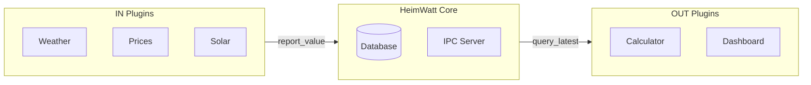

# Design Study: SDK Plugin Taxonomy

> **Status**: Draft  
> **Priority**: P1  
> **Related Code**: [Manual/sdk.md](../Manual/sdk.md), [plugin_mgr.c](../src/core/plugin_mgr.c)

---

## Problem Statement

The SDK currently uses a simple `in`/`out` plugin type distinction:
- **IN plugins**: Push data into Core (sensors, API wrappers)
- **OUT plugins**: Pull data from Core and expose endpoints (calculators, dashboards)

This binary model may be insufficient for complex integrations that need to:
- Both report sensor data AND control actuators (heat pumps, thermostats)
- Provide optimization constraints to a solver
- Query historical data while also pushing real-time updates

**Key Question**: Is `in`/`out` the right abstraction, or do we need a capability-based model?

---

## Current Architecture



### Current Capabilities (from manifest schema)

| Capability | Description | Example Use |
|------------|-------------|-------------|
| `report` | Push semantic data to Core | Weather sensor pushing temperature |
| `query` | Pull semantic data from Core | Dashboard reading price history |
| `actuate` | Control external devices | Setting heat pump target temp |
| `constrain` | Provide optimization constraints | Battery min/max SoC limits |
| `sense` | Real-time sensor stream | GPIO pin monitoring |

---

## The Challenge: Complex Integrations

Consider a heat pump integration (e.g., MELCloud):

**Needs to**:
1. **Report** current power consumption → `report`
2. **Report** current COP → `report`
3. **Query** electricity prices → `query`
4. **Actuate** set target temperature → `actuate`
5. **Constrain** provide min/max temperature limits → `constrain`

This plugin is neither purely "IN" nor "OUT" — it needs multiple capabilities.

---

## Proposed Architecture

### Option A: Capability-Based Model (Recommended)

Replace binary `in`/`out` with a capability bitmask. The `type` field becomes informational, not functional.

```json
{
  "id": "com.heimwatt.melcloud",
  "type": "integration",
  "capabilities": ["report", "query", "actuate", "constrain"],
  "devices": [
    {
      "type": "heat_pump",
      "provides": ["hvac.power.actual", "hvac.cop.actual"],
      "consumes": ["schedule.heat_pump.power"]
    }
  ]
}
```

**Capability Matrix**:

| Capability | IPC Commands | Direction |
|------------|--------------|-----------|
| `report` | `REPORT` | Plugin → Core |
| `query` | `QUERY_LATEST`, `QUERY_RANGE` | Plugin ← Core |
| `actuate` | `DEVICE_SETPOINT` | Plugin → Device |
| `constrain` | `QUERY_CONSTRAINTS` (future) | Solver ← Plugin |
| `sense` | `REGISTER_FD` | Plugin → Core (real-time) |

**Benefits**:
- Flexible: Any combination of capabilities
- Future-proof: New capabilities can be added
- Self-documenting: Manifest declares what plugin can do

**Drawbacks**:
- More complex manifest validation
- Plugins must correctly declare capabilities

### Option B: Extended Type Hierarchy

Add more plugin types:

```
plugin_type:
  - sensor      (report only)
  - data_source (report)
  - actuator    (actuate)
  - integration (report + query + actuate)
  - calculator  (query + http endpoints)
  - constraint  (constrain)
```

**Benefits**:
- Clear categories
- Easier to understand

**Drawbacks**:
- Rigid: What if a sensor also needs query?
- Combinatorial explosion of types

---

## Device Model

A plugin can manage multiple devices. Each device has:

```json
{
  "devices": [
    {
      "type": "heat_pump",
      "name": "Living Room Heat Pump",
      "provides": ["hvac.power.actual", "hvac.cop.actual"],
      "consumes": ["schedule.heat_pump.power"],
      "safety": {
        "min_temp_c": 16,
        "max_temp_c": 28,
        "min_cycle_s": 600
      }
    }
  ]
}
```

**Fields**:
- `type`: Device category (heat_pump, valve, sensor, etc.)
- `name`: Human-readable identifier
- `provides`: Semantic types this device produces
- `consumes`: Semantic types this device accepts as commands
- `safety`: Device-specific safety limits

---

## Credential Model

External API integrations need credentials. The SDK must:
1. Request credentials securely
2. Handle OAuth token refresh transparently
3. Zero credentials in memory after use

```json
{
  "credentials": {
    "type": "oauth2",
    "provider": "melcloud",
    "required": ["client_id", "client_secret"],
    "scopes": ["device:read", "device:control"]
  }
}
```

**Credential Types**:
- `api_key`: Simple API key
- `password`: Username/password pair
- `oauth2`: OAuth 2.0 flow with automatic refresh

---

## Open Questions

1. **Constraint Collection**: How does the solver collect constraints from multiple plugins?
2. **Device Discovery**: Should Core auto-discover devices or require manual manifest updates?
3. **Capability Enforcement**: Should Core validate that plugins only use declared capabilities?
4. **Multi-Device Commands**: How do we address commands to specific devices within a plugin?

---

## Integration Examples

### Example 1: Garden Irrigation

```json
{
  "id": "com.mygarden.irrigation",
  "capabilities": ["report", "actuate", "sense"],
  "devices": [
    {"type": "sensor", "provides": ["garden.soil_moisture"]},
    {"type": "valve", "provides": ["garden.valve.state"]}
  ]
}
```

### Example 2: Stock Portfolio Tracker

```json
{
  "id": "com.myfinance.stocks",
  "capabilities": ["report"],
  "credentials": {
    "type": "api_key",
    "required": ["api_key"]
  }
}
```

### Example 3: Full Home Battery System

```json
{
  "id": "com.heimwatt.battery",
  "capabilities": ["report", "query", "actuate", "constrain"],
  "devices": [
    {
      "type": "battery",
      "provides": ["battery.soc", "battery.power.actual"],
      "consumes": ["schedule.battery.power"],
      "safety": {"min_soc": 10, "max_soc": 90, "max_power_kw": 5}
    }
  ]
}
```

---

## Design Decision

**Recommendation**: Option A (Capability-Based Model)

The `type` field should become a hint for UI categorization, not a functional constraint. Capabilities should drive what IPC commands a plugin can use.

---

## Notes

*Add iteration notes here as the design evolves.*
