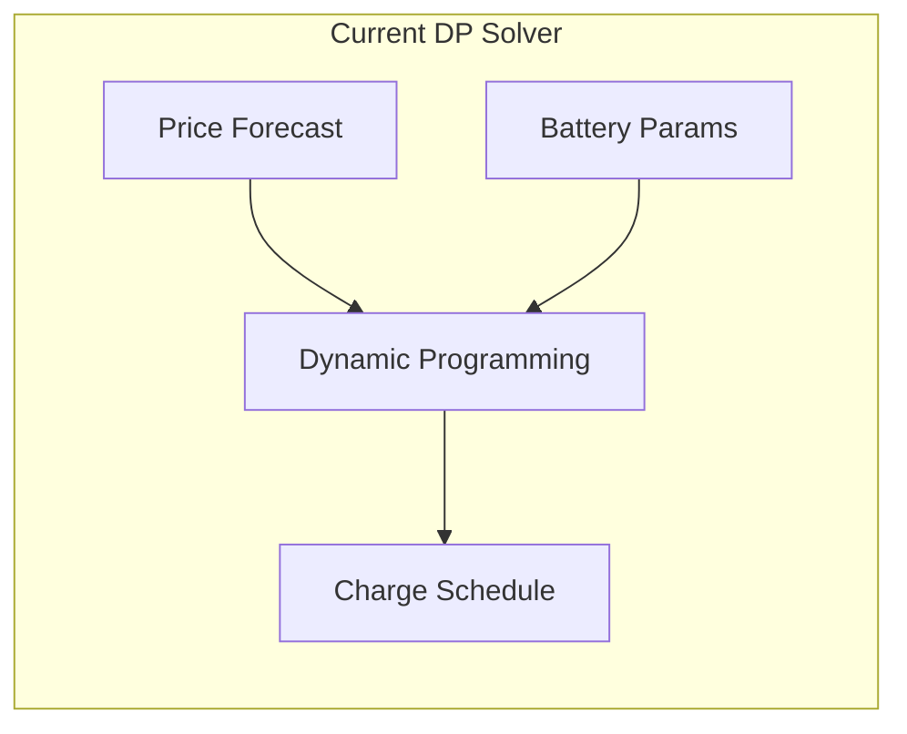
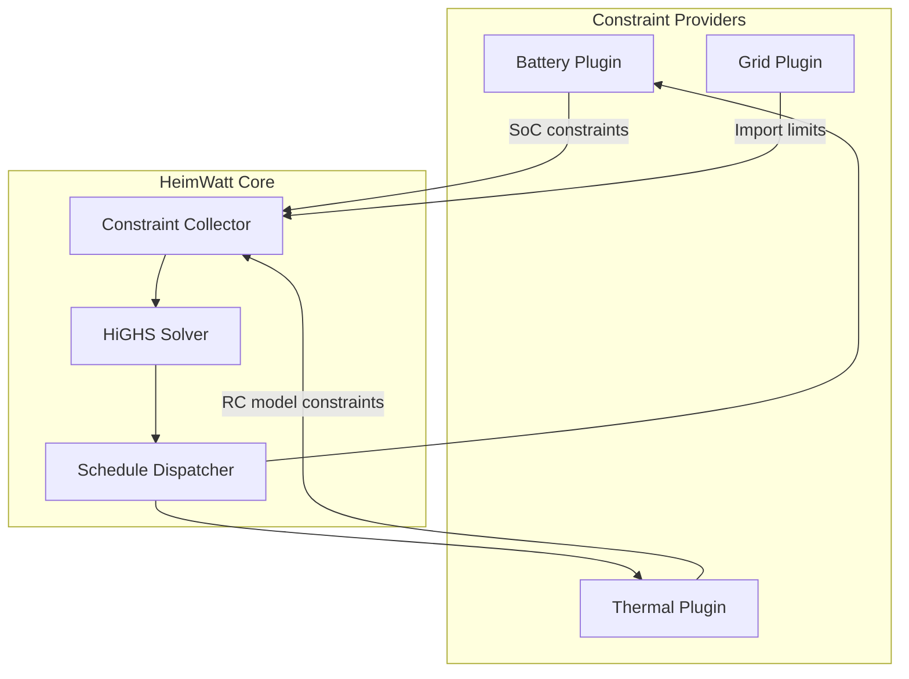

# Design Study: Solver Integration (HiGHS)

> **Status**: Draft  
> **Priority**: P2  
> **Related Code**: (future implementation)

---

## Problem Statement

The current "LPS" solver (`lps.c`) is actually a Dynamic Programming solver with state discretization, not a Linear/Mixed-Integer Linear Programming solver. This creates confusion and limits capabilities:

- **Naming**: "LPS" implies Linear Programming, but implementation is DP
- **Scalability**: DP complexity grows exponentially with state dimensions
- **Flexibility**: Cannot handle arbitrary linear constraints from plugins

For thermal dynamics, multi-asset optimization, and flexible constraint systems, a true LP/MILP solver is needed.

---

## Current State



**Limitations**:
- Fixed 101 SoC states (1% granularity)
- O(T × S × A) complexity where T=hours, S=states, A=actions
- Cannot incorporate arbitrary constraints (thermal, grid limits, multiple assets)

---

## Proposed Architecture: HiGHS Integration

[HiGHS](https://highs.dev/) is the gold standard for open-source LP/MILP:
- MIT licensed
- Handles millions of variables/constraints
- Active development, used in industry



---

## Constraint Provider Model

Plugins with `constrain` capability provide linear constraints to the solver:

### Constraint Interface

```c
typedef struct {
    const char *name;           // e.g., "battery_soc_min"
    double *coefficients;       // Variable coefficients
    size_t num_vars;
    double lower_bound;         // >= lb
    double upper_bound;         // <= ub
    constraint_type type;       // CONTINUOUS, INTEGER, BINARY
} linear_constraint;

// Plugin provides constraints via IPC
int sdk_provide_constraints(plugin_ctx *ctx, linear_constraint *constraints, size_t count);
```

### Example: Battery Constraints

```
Objective: Minimize electricity cost
    min Σ(price[t] × grid_import[t])

Subject to:
    SoC[t+1] = SoC[t] + charge[t] × η - discharge[t] / η    (energy balance)
    0 ≤ SoC[t] ≤ 1                                          (capacity limits)
    -P_max ≤ power[t] ≤ P_max                               (power limits)
    grid_import[t] = load[t] + charge[t] - discharge[t]     (grid balance)
```

### Example: Thermal Constraints (RC Model)

```
T_indoor[t+1] = α × T_indoor[t] + β × T_outdoor[t] + γ × Q_heat[t]
T_min ≤ T_indoor[t] ≤ T_max
Q_heat[t] ≥ 0
```

---

## Integration Options

### Option A: Direct Library Linking (Recommended)

Link HiGHS as a library in Core:

```makefile
LDFLAGS += -lhighs
```

**Pros**:
- Fast: No IPC overhead
- Simple: Direct API calls

**Cons**:
- Core grows in complexity
- HiGHS updates require Core rebuild

### Option B: Solver as Plugin

Solver runs as a separate process, communicates via IPC:

```
[Core] <--IPC--> [Solver Plugin (HiGHS)]
```

**Pros**:
- Crash isolation
- Swappable solvers (HiGHS, GLPK, etc.)

**Cons**:
- IPC overhead for large problems
- More complex architecture

### Option C: Hybrid

Core has simple built-in optimization (current DP), advanced solver as plugin:

**Pros**:
- Backwards compatible
- Graceful fallback

**Cons**:
- Two code paths to maintain

---

## Design Decision

| Option | Complexity | Performance | Flexibility |
|--------|------------|-------------|-------------|
| **A: Direct** | Medium | High | Medium |
| **B: Plugin** | High | Medium | High |
| **C: Hybrid** | High | High | High |

**Recommendation**: Start with Option A. Consider Option B when multiple solver backends are needed.

---

## Migration Path

```
Phase 1: Rename current solver
- lps.c → dp_battery_scheduler.c
- Update all references
- Document as "simple mode"

Phase 2: Add HiGHS dependency
- Add to build system
- Create solver interface abstraction

Phase 3: Implement LP battery model
- Port battery optimization to LP formulation
- Verify equivalent results to DP

Phase 4: Add constraint provider protocol
- Define IPC messages for constraint submission
- Implement SDK functions
- Test with battery plugin

Phase 5: Thermal model
- Implement RC thermal constraints
- Integrate with heat pump plugin
```

---

## Open Questions

1. Should constraints be collected continuously or at scheduled optimization times?
2. How to handle constraint conflicts (infeasible problems)?
3. Should the solver run on-demand or at fixed intervals?
4. How to communicate optimal schedules back to plugins?

---

## References

- [HiGHS Documentation](https://ergo-code.github.io/HiGHS/)
- [LP Formulation for Battery Optimization](https://arxiv.org/abs/...) (placeholder)
- [RC Thermal Model](https://en.wikipedia.org/wiki/Lumped-element_model)

---

## Notes

*Add iteration notes here as the design evolves.*
